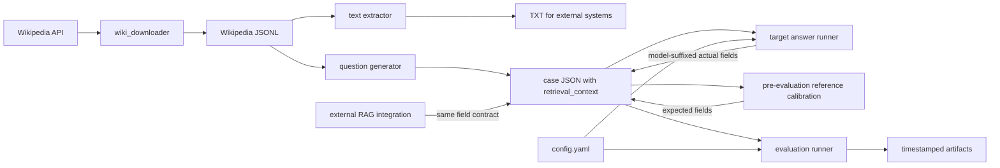

# 系统架构

## 目标与边界

本仓库提供一条离线数据流水线：获取 Wikipedia 材料，生成带原文引用的可回答问题，通过跨文章错配构造不可回答问题，让目标模型作答，再由 DeepEval 裁判模型计算决策指标和回答质量指标。

内置脚本可调用 OpenAI 兼容模型，但不会自动上传文档或调用 Veris 等外部 RAG 系统。外部系统需自行接入并按相同字段契约回写结果。

## 组件

| 文件 | 职责 |
| --- | --- |
| `wiki_downloader/wiki_downloader.py` | 随机下载英文 Wikipedia 页面、去重、过滤短文并追加 JSONL；可按已有 page ID 续传。 |
| `analyze_jsonl_characters.py` | 统计 JSONL 每行字符数。 |
| `extract_wikipedia_texts.py` | 将 `text` 提取为 Windows 安全的 `{page_id}-{title}.txt`。TXT 只用于外部上传或人工检查。 |
| `generate_wikipedia_test_cases.py` | 从退役题库继承材料与 `veri_file_id`；每篇一次请求生成 2 道带逐字引用的可回答题，再跨文章错配得到 2 道不可回答题；逐案例原子保存并支持断点恢复。 |
| `answer_models.py` | 按 `answering.models` 并发调用 GPT 与 DeepSeek；共用配置中的可追溯回答提示词；工作线程只请求 API，主线程串行合并完整字段对并原子保存。 |
| `gpt-4o-mini_answer.py` | 兼容入口，委托 `answer_models.py` 只运行 GPT-4o-mini。 |
| `genimi-3.5-flash_answer.py` | 历史 Gemini 作答器；当前评估目标已移除 Gemini，不用于新 800 题流程。 |
| `veriai_answer.py` | 按 JSON 顺序向 Veris 上传每篇文章的 TXT，将文件 ID 和逐题回答原子写回用例，并跳过已有完整结果以支持续跑。 |
| `judge_veri_answered.py` | 使用 `judge.model` 根据 `actual_output_veri` 重新判定并逐题保存 `actual_answered_veri`；保存裁判模型标记以支持断点恢复。 |
| `calibrate_reference_answers.py` | 在正式评估前直接从用例中筛选 GPT/DeepSeek 回答与拒答不一致的题，使用 DeepSeek 和精确 `retrieval_context` 校正 golden 字段；逐题原子保存审计，`--apply` 只应用高置信、无歧义的建议。 |
| `revise_reference_answers.py` | 从至少两个可用模型的历史结果中筛选决策不一致及一致 NA/AN 用例，向审核模型直接提供 `retrieval_context`、当前参考答案和可用模型回答，逐题保存参考答案修订审计；不上传文件，仅在 `--apply` 时应用高置信建议。 |
| `evaluation.py` | 按目标加载已有完整作答，对 `target.models × judge.models` 的每个组合独立构建四项 DeepEval 指标、并发评估并输出汇总。 |
| `evaluation.sh` | 从项目根目录加载 `.env`，校验 `.venv`、`OPENAI_API_KEY` 与 `DEEPSEEK_API_KEY`，再用 `.venv/bin/python -u` 启动双裁判评估器。 |
| `tools/openai_interceptor.py` | 拦截 DeepEval 使用的 Chat Completions 调用，记录请求、响应、错误和 token。 |
| `test_evaluation_logic.py` | 不访问网络的核心契约回归测试。 |
| `test_chatbot.py`、`test_veris.py` | 会访问裁判模型的示例/集成测试，可能产生费用。 |

## 数据流



关键原则：生成、作答和评估共享用例 JSON 中保存的同一份 `retrieval_context`。新题库直接继承退役题库的上下文与上传文件 ID，不读取完整 TXT，也不重新上传材料。

新题库固定使用 200 个案例素材、每个案例 4 题，共 800 题。ChatGPT 对每个案例只用一次请求生成 2 道明确可回答的问题、简洁答案和可在上下文中逐字定位的引用；另外 2 道题来自其他案例的可回答题。错配源文章标题不得出现在目标上下文中，且两道错配题来自不同案例。模型不直接生成不可回答问题。

每篇文章的 2 道可回答题在一次结构化请求中返回并整组校验。某篇达到重试上限时只保留该篇缺口并继续后续文章；所有文章都具备 2 道可回答题后才统一构造错配题。重复运行同一命令会跳过完整文章并补齐缺口。

前置参考答案校正发生在 GPT/DeepSeek 考生作答之后、Veri 作答和正式评估之前。只有两者均有完整字段且 `actual_answered_gpt-4o-mini != actual_answered_deepseek` 的题会进入候选。DeepSeek 审核提示包含题目、当前 golden、两份考生输出和实际提供给考生的 `retrieval_context`；考生输出只作线索，上下文是唯一事实依据。审核模型返回证据段编号，脚本从原文构建 `Source citation`，不信任模型抄写引用。候选回答字段不会被修改。

旧的 `revise_reference_answers.py` 是基于历史 `evaluation_results` 的事后扩展审计工具，不属于新 800 题的标准前置流程。

## 数据契约

### Wikipedia JSONL

每行一个对象，必需字段：

```json
{
  "page_id": 70533387,
  "title": "Ahmad Bazzi",
  "text": "Article text...",
  "url": "https://en.wikipedia.org/wiki/Ahmad_Bazzi"
}
```

`url` 对生成器可选；`page_id`、`title` 和非空字符串 `text` 必需。

### 评估用例

```json
{
  "name": "wikipedia_70533387_ahmad_bazzi",
  "page_id": 70533387,
  "title": "Ahmad Bazzi",
  "retrieval_context": ["Article text..."],
  "veri_file_id": "xxxxxxxx-xxxx-xxxx-xxxx-xxxxxxxxxxxx",
  "questions": [
    {
      "name": "research_focus",
      "input": "What field does Ahmad Bazzi specialize in?",
      "expected_answered": true,
      "expected_output": "Wireless communications.\n\nSource citation: \"His research focuses on wireless communications.\"",
      "reference_citation": "His research focuses on wireless communications.",
      "actual_answered": null,
      "actual_output": null,
      "actual_answered_gpt-4o-mini": true,
      "actual_output_gpt-4o-mini": "Wireless communications.",
      "actual_answered_veri": true,
      "actual_output_veri": "【Answer】\\nWireless communications.\\n\\n【Cited passage】\\n...\\n\\n【Source】\\nAhmad Bazzi (filename: 70533387-Ahmad Bazzi.txt)\\n\\n【Source index】\\nfile_id: xxxxxxxx-xxxx-xxxx-xxxx-xxxxxxxxxxxx\\nfilename: 70533387-Ahmad Bazzi.txt\\ntitle: Ahmad Bazzi"
    }
  ]
}
```

错配题保持相同核心字段，并额外保存 `mismatched_from_page_id` 和 `mismatched_from_title` 供审计；其 `expected_answered` 为 `false`，参考输出说明当前材料不足。生成阶段不写任何考生模型后缀字段。

`answering.models[].id` 决定统一作答器写入的后缀；`target.models` 决定评估器读取的一个或多个后缀。例如 `gpt-4o-mini` 对应：

- `actual_answered_gpt-4o-mini`
- `actual_output_gpt-4o-mini`

评估器按 `target.models` 分别读取后缀字段。某个目标的两项后缀字段都不存在时，该题不进入该目标的评估样本或统计分母；只出现一个字段、Boolean 类型错误或输出为空时仍立即失败，避免静默接受损坏的部分结果。显式使用 `allow_partial=False` 时才兼容回退到无后缀旧字段。

作答器的输入由 `--input` 指定，默认是 `evaluation_cases/test_cases_novel.json`；评估器的输入由 `config.yaml` 中的 `project.cases_file` 指定。修改数据文件时必须确保两者指向同一份用例，否则可能出现“作答已完成但评估仍报告字段缺失”的情况。

Veris 集成按篇保存 `veri_file_id`，按题保存固定后缀字段 `actual_answered_veri` 和 `actual_output_veri`。`actual_output_veri` 保存完整文本响应，并追加由当前文档的 `file_id`、文件名和标题组成的 `【Source index】`；模型生成的引用格式或内容不会阻止落盘。`actual_answered_veri` 仅为兼容现有 Boolean 契约而按中英文拒答措辞粗略判定，不作为 Veris 响应是否保存的门控。运行前 `.env` 必须提供 `VERI_API_KEY`。

## 配置契约

`config.yaml` 的核心配置：

- `project.cases_file`：用例 JSON。
- `project.results_directory`：评估输出根目录。
- `answering.models`：API 考生列表。每项包含稳定字段后缀 `id`、API 模型名、key 环境变量和可选 `base_url`。
- `answering.prompt`：GPT 与 DeepSeek 共用的作答提示词；要求仅依据上下文回答，并在实际回答时附上可追溯来源引用，允许轻微改写。
- `answering.max_workers`：跨模型、跨问题的 API 工作线程数。工作线程不写共享 JSON，主线程逐结果原子保存，避免条件竞争和顺序损坏。
- `reference_calibration`：前置 golden 校正使用的 DeepSeek 模型、API key 环境变量、OpenAI 兼容端点和审核提示。
- `target.model`：旧作答脚本兼容值。
- `target.models`：评估器依次读取的模型字段后缀列表；未设置时兼容回退到 `target.model`。
- `judge.model`：Veri 决策重判等旧脚本使用的兼容裁判。
- `judge.models`：质量评估裁判列表。当前分别通过 OpenAI 和 DeepSeek provider 使用 GPT-4o-mini 与 DeepSeek-V4.1-Flash（API 标识 `deepseek-flash`）。
- `evaluation.max_workers`：并发数；越高越容易触发限流并扩大瞬时费用。
- `metrics.*`：阈值和裁判说明。
- `output.*`：产物文件名。
- `openai_interceptor.*`：交互日志开关与文件名；当前关闭，不再写入完整 OpenAI 交互。

## 运行顺序与恢复语义

标准运行顺序：

```bash
source .venv/bin/activate
python generate_wikipedia_test_cases.py
python answer_models.py
python -u calibrate_reference_answers.py --limit 10
python -u calibrate_reference_answers.py
# 人工检查审计文件后：
python -u calibrate_reference_answers.py --apply
python veriai_answer.py
python judge_veri_answered.py
bash evaluation.sh
```

生成器默认从 `evaluation_cases/test_cases_novel.retired-16000.json` 的前 200 篇继承材料和 `veri_file_id`，生成新的 `evaluation_cases/test_cases_novel.json`。默认结果为 400 道可回答题和 400 道跨案例错配的不可回答题。

Veris 小批量运行示例：

```bash
source .venv/bin/activate
python veriai_answer.py --document-limit 10
```

当前 `answering.models` 会同时处理 GPT-4o-mini 与 DeepSeek-V4.1-Flash（API 标识 `deepseek-flash`），分别只写 `actual_answered_<id>` 和 `actual_output_<id>`。`veri` 使用专用作答器。当前 `target.models` 为 `gpt-4o-mini`、`veri` 和 `deepseek`；`judge.models` 也使用 GPT-4o-mini 和 DeepSeek-V4.1-Flash，因此完整评估会为每个已有考生输出分别创建两个裁判结果目录。

Veris 决策重判与双目标评估：

```bash
source .venv/bin/activate
python -u judge_veri_answered.py
bash evaluation.sh
```

前置参考答案校正：

```bash
source .venv/bin/activate
# 小批量检查质量和成本；不修改用例
python -u calibrate_reference_answers.py --limit 10
# 检查 evaluation_results/pre_evaluation_reference_calibration.json 后续跑全部
python -u calibrate_reference_answers.py
# 人工检查后，只应用高置信且无歧义的建议
python -u calibrate_reference_answers.py --apply
```

校正器只检查 GPT 与 DeepSeek 回答/拒答 Boolean 不一致的题；缺少任一完整字段或两者决策一致时不会调用审核 API。审计逐题原子保存，失败项可在重复运行时重试。`--apply` 不发起已完成题目的请求，只修改 `expected_answered` 与 `expected_output`；中低置信或歧义建议留给人工检查。

每个目标只评估同时包含 Boolean `actual_answered_<model>` 和非空字符串 `actual_output_<model>` 的题目，因此允许对部分作答文件进行评估；缺字段题目不计入该目标的任何统计。

两个阶段的恢复语义不同：

- 作答器在每次成功响应后原子保存整个用例 JSON，并默认跳过已有的完整模型后缀字段，因此中断后重复同一命令即可续跑。`--limit` 限制本次处理的未回答题数，适合分批控制成本；`--overwrite` 会重生成已有回答。
- 统一 API 作答器的 `--limit` 以“模型 × 问题”任务计数。网络请求在线程池并发执行，但线程不接触共享文档；主线程收到完整结构化响应后才一次写入 Boolean 与输出字段，并通过临时文件替换完成原子保存。
- Veris 答题器启动时只为 TXT 目录建立一次索引，不执行全量逐文档预校验；文档、上传或单题异常会记录并跳过，继续处理后续项目。每次文件上传和每道题响应后仍原子保存。重复运行会复用 `veri_file_id`；已有引用区块的回答只补齐来源索引并跳过网络请求，旧格式回答则重新请求。`--document-limit` 限制从 JSON 开头选择的文档数。
- Veris 决策重判器只判断输出是否实际尝试回答，不判断答案事实正确性；逐题原子保存 `actual_answered_veri` 和 `actual_answered_veri_judged_by`。重复运行会跳过已由当前 `judge.model` 判定的题目，`--limit` 可用于小批量成本检查。
- 评估器在每个指标响应后原子更新当前运行目录的 `results.json`。单个指标失败时按 `evaluation.metric_retries` 重试；耗尽后仅将该题标记为技术失败并继续，技术失败题不进入模型质量或决策统计。中断时已返回结果仍可检查，但评估器不会从该快照继续执行。

WSL 与 RackNerd 使用相同脚本和顺序，只需进入各自项目目录。`.env` 必须提供 `OPENAI_API_KEY` 和 `DEEPSEEK_API_KEY`；不依赖 Conda。

## 决策与指标逻辑

| 状态 | expected_answered | actual_answered | 含义 |
| --- | ---: | ---: | --- |
| AA | true | true | 材料有答案，系统作答。 |
| NN | false | false | 材料无答案，系统拒答。 |
| AN | true | false | 错误拒答。 |
| NA | false | true | 无材料支持仍作答。 |

指标适用性：

| 指标 | 实际作答 | 实际拒答 |
| --- | --- | --- |
| Correctness | 参与判定 | 参与判定 |
| Answer Relevancy | 参与判定 | 仅诊断 |
| Faithfulness | 参与判定 | 仅诊断 |
| Contextual Relevancy | 仅诊断 | 仅诊断 |

```text
decision_passed = state in {AA, NN}
case_passed = decision_passed and all(applicable metric passed)
```

决策汇总包括 AA/NN/AN/NA 计数、Decision Accuracy、False Refusal Rate、Hallucinated Answer Rate、Answer Precision、Answer Recall 和 Abstention Precision。零分母输出 `null`。

质量汇总按状态条件化：AA 的 Correctness/Faithfulness/Answer Relevancy 均值、NN 的 Correctness 均值，以及：

```text
Correct Answer Rate = #(AA 且 Correctness 通过) / #(expected_answered = true)
```

## 运行产物

成功完成的每个考生/裁判组合创建：

```text
evaluation_results/{timestamp}-{target_model}-judge-{judge_model}/
```

包含：

- `results.json`：决策汇总、质量汇总和逐用例结果。
- `summary.csv`：每个用例/指标一行，包含是否参与用例判定。
- `token_summary.json`：拦截到的裁判请求 token 汇总。
- `config_snapshot.yaml`：运行时配置快照。
- `openai_interactions.jsonl`：仅在显式启用拦截器时生成；当前配置关闭。

中断或异常运行可能只留下部分产物；输入校验失败也可能留下空的时间戳目录，因为运行目录在加载用例前创建。token 汇总只覆盖 DeepEval 的 Chat Completions；生成器和作答器使用 Responses API，不计入该汇总。

`results.json` 是实时快照，而不是仅在运行结束时生成：

- 运行开始即写入空进度与空汇总；
- 每个 metric 响应返回后，在异步写锁内更新对应用例；
- 通过 `.tmp` 文件替换保证任意时刻读取到完整 JSON；
- `progress` 记录用例和 metric 响应进度；
- `in_progress` 用例保留已返回指标，但不进入总体汇总；
- 每完成一个用例重新计算决策汇总和条件质量汇总并输出到终端。

指标结果同时保存稳定 `id` 和显示 `name`。门控和汇总只依赖 `id`，避免 DeepEval 指标对象未提供 `name` 时发生逻辑漂移。

## 可靠性设计

- 生成器和作答器都通过临时文件替换实现原子 JSON 保存。
- 评估器同样在每个 metric 响应后原子保存实时 `results.json`，并用异步锁串行化并发写入。
- 每成功生成一道题或取得一个回答后立即保存。
- 作答器通过跳过已有完整回答实现断点续跑；评估器只保留中断快照，不实现断点续跑。
- 生成器恢复时校验已有 page ID 与当前选择集一致；允许多个案例因 API 或校验失败而暂时缺题，重复运行会仅补齐这些缺口。
- 抽样由 `--sample` 和 `--seed` 控制；恢复时必须保持 `--start`、`--sample`、`--seed`、题数等选择参数兼容。
