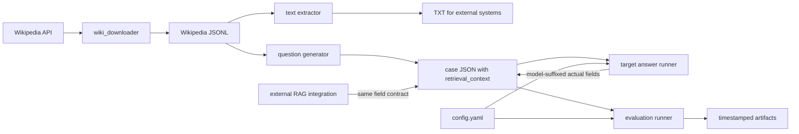

# 系统架构

## 目标与边界

本仓库提供一条离线数据流水线：获取 Wikipedia 材料，生成可回答/不可回答问题，让目标模型作答，再由 DeepEval 裁判模型计算决策指标和回答质量指标。

内置脚本可调用 OpenAI 兼容模型，但不会自动上传文档或调用 Veris 等外部 RAG 系统。外部系统需自行接入并按相同字段契约回写结果。

## 组件

| 文件 | 职责 |
| --- | --- |
| `wiki_downloader/wiki_downloader.py` | 随机下载英文 Wikipedia 页面、去重、过滤短文并追加 JSONL；可按已有 page ID 续传。 |
| `analyze_jsonl_characters.py` | 统计 JSONL 每行字符数。 |
| `extract_wikipedia_texts.py` | 将 `text` 提取为 Windows 安全的 `{page_id}-{title}.txt`。TXT 只用于外部上传或人工检查。 |
| `generate_wikipedia_test_cases.py` | 用 Responses API 生成结构化题目；交替生成 answerable/unanswerable；逐题原子保存并支持断点恢复。 |
| `gpt-4o-mini_answer.py` | 使用 `target.model` 对每道题作答；严格使用用例内的 `retrieval_context`；逐题写入模型后缀字段。 |
| `evaluation.py` | 加载目标模型作答，构建四项 DeepEval 指标，并发评估，输出决策和条件质量汇总。 |
| `tools/openai_interceptor.py` | 拦截 DeepEval 使用的 Chat Completions 调用，记录请求、响应、错误和 token。 |
| `test_evaluation_logic.py` | 不访问网络的核心契约回归测试。 |
| `test_chatbot.py`、`test_veris.py` | 会访问裁判模型的示例/集成测试，可能产生费用。 |

## 数据流



关键原则：生成、作答和评估共享用例 JSON 中保存的同一份 `retrieval_context`。生成器默认最多保存每篇文章前 12,000 个字符，因此完整 TXT 可能包含额外信息，不能作为内置作答器的上下文。

## 数据契约

### Wikipedia JSONL

每行一个对象，必需字段：

```json
{
  "page_id": 70533387,
  "title": "Ahmad Bazzi",
  "text": "Article text...",
  "url": "https://en.wikipedia.org/wiki/Ahmad_Bazzi"
}
```

`url` 对生成器可选；`page_id`、`title` 和非空字符串 `text` 必需。

### 评估用例

```json
{
  "name": "wikipedia_70533387_ahmad_bazzi",
  "page_id": 70533387,
  "title": "Ahmad Bazzi",
  "retrieval_context": ["Article text..."],
  "questions": [
    {
      "name": "research_focus",
      "input": "What field does Ahmad Bazzi specialize in?",
      "expected_answered": true,
      "expected_output": "Wireless communications.",
      "actual_answered": null,
      "actual_output": null,
      "actual_answered_gpt-4o-mini": true,
      "actual_output_gpt-4o-mini": "Wireless communications."
    }
  ]
}
```

`target.model` 决定后缀，例如 `gpt-4o-mini` 对应：

- `actual_answered_gpt-4o-mini`
- `actual_output_gpt-4o-mini`

评估器优先读取后缀字段；仅当两者都不存在时，才回退到无后缀旧字段。任一实际作答字段类型无效时应立即失败，而不是猜测。

## 配置契约

`config.yaml` 的核心配置：

- `project.cases_file`：用例 JSON。
- `project.results_directory`：评估输出根目录。
- `target.model`：被测模型及实际字段后缀。
- `judge.model`：DeepEval 裁判模型。
- `evaluation.max_workers`：并发数；越高越容易触发限流并扩大瞬时费用。
- `metrics.*`：阈值和裁判说明。
- `output.*`：产物文件名。
- `openai_interceptor.*`：交互日志开关与文件名。

## 决策与指标逻辑

| 状态 | expected_answered | actual_answered | 含义 |
| --- | ---: | ---: | --- |
| AA | true | true | 材料有答案，系统作答。 |
| NN | false | false | 材料无答案，系统拒答。 |
| AN | true | false | 错误拒答。 |
| NA | false | true | 无材料支持仍作答。 |

指标适用性：

| 指标 | 实际作答 | 实际拒答 |
| --- | --- | --- |
| Correctness | 参与判定 | 参与判定 |
| Answer Relevancy | 参与判定 | 仅诊断 |
| Faithfulness | 参与判定 | 仅诊断 |
| Contextual Relevancy | 仅诊断 | 仅诊断 |

```text
decision_passed = state in {AA, NN}
case_passed = decision_passed and all(applicable metric passed)
```

决策汇总包括 AA/NN/AN/NA 计数、Decision Accuracy、False Refusal Rate、Hallucinated Answer Rate、Answer Precision、Answer Recall 和 Abstention Precision。零分母输出 `null`。

质量汇总按状态条件化：AA 的 Correctness/Faithfulness/Answer Relevancy 均值、NN 的 Correctness 均值，以及：

```text
Correct Answer Rate = #(AA 且 Correctness 通过) / #(expected_answered = true)
```

## 运行产物

成功完成的评估运行创建：

```text
evaluation_results/{timestamp}-{judge_model}/
```

包含：

- `results.json`：决策汇总、质量汇总和逐用例结果。
- `summary.csv`：每个用例/指标一行，包含是否参与用例判定。
- `token_summary.json`：拦截到的裁判请求 token 汇总。
- `config_snapshot.yaml`：运行时配置快照。
- `openai_interactions.jsonl`：启用拦截器时的完整裁判交互。

中断或异常运行可能只留下部分产物。token 汇总只覆盖 DeepEval 的 Chat Completions；生成器和作答器使用 Responses API，不计入该汇总。

## 可靠性设计

- 生成器和作答器都通过临时文件替换实现原子 JSON 保存。
- 每成功生成一道题或取得一个回答后立即保存。
- 生成器恢复时要求已有 page ID 是当前选择集前缀，且只有最后一篇可以未完成。
- 抽样由 `--sample` 和 `--seed` 控制；恢复时必须保持 `--start`、`--sample`、`--seed`、题数等选择参数兼容。
