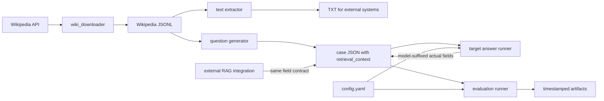

# 系统架构

## 目标与边界

本仓库提供一条离线数据流水线：获取 Wikipedia 材料，生成可回答/不可回答问题，让目标模型作答，再由 DeepEval 裁判模型计算决策指标和回答质量指标。

内置脚本可调用 OpenAI 兼容模型，但不会自动上传文档或调用 Veris 等外部 RAG 系统。外部系统需自行接入并按相同字段契约回写结果。

## 组件

| 文件 | 职责 |
| --- | --- |
| `wiki_downloader/wiki_downloader.py` | 随机下载英文 Wikipedia 页面、去重、过滤短文并追加 JSONL；可按已有 page ID 续传。 |
| `analyze_jsonl_characters.py` | 统计 JSONL 每行字符数。 |
| `extract_wikipedia_texts.py` | 将 `text` 提取为 Windows 安全的 `{page_id}-{title}.txt`。TXT 只用于外部上传或人工检查。 |
| `generate_wikipedia_test_cases.py` | 用 Responses API 生成结构化题目；交替生成 answerable/unanswerable；逐题原子保存并支持断点恢复。 |
| `gpt-4o-mini_answer.py` | 使用 `target.model` 对每道题作答；严格使用用例内的 `retrieval_context`；逐题写入模型后缀字段，并跳过已有完整回答以支持续跑。 |
| `genimi-3.5-flash_answer.py` | 使用 Gemini 3.5 Flash 和结构化输出逐题写入 `actual_answered_gemini-3.5-flash`、`actual_output_gemini-3.5-flash`；严格使用用例内上下文并逐题原子保存。 |
| `veriai_answer.py` | 按 JSON 顺序向 Veris 上传每篇文章的 TXT，将文件 ID 和逐题回答原子写回用例，并跳过已有完整结果以支持续跑。 |
| `judge_veri_answered.py` | 使用 `judge.model` 根据 `actual_output_veri` 重新判定并逐题保存 `actual_answered_veri`；保存裁判模型标记以支持断点恢复。 |
| `revise_reference_answers.py` | 从至少两个可用模型的历史结果中筛选决策不一致及一致 NA/AN 用例，向审核模型同时提供完整 TXT、精确 `retrieval_context` 和可用模型回答，逐题保存参考答案修订审计；仅在 `--apply` 时应用高置信建议。 |
| `evaluation.py` | 按目标加载已有完整作答，构建四项 DeepEval 指标，并发评估，输出决策和条件质量汇总。 |
| `evaluation.sh` | 从项目根目录加载 `.env`，校验 `.venv` 与 `OPENAI_API_KEY`，再用 `.venv/bin/python -u` 启动评估器。 |
| `tools/openai_interceptor.py` | 拦截 DeepEval 使用的 Chat Completions 调用，记录请求、响应、错误和 token。 |
| `test_evaluation_logic.py` | 不访问网络的核心契约回归测试。 |
| `test_chatbot.py`、`test_veris.py` | 会访问裁判模型的示例/集成测试，可能产生费用。 |

## 数据流



关键原则：生成、作答和评估共享用例 JSON 中保存的同一份 `retrieval_context`。生成器默认最多保存每篇文章前 12,000 个字符，因此完整 TXT 可能包含额外信息，不能作为内置作答器的上下文。

参考答案审核同样保持这个边界：完整 TXT 用于诊断全文与截断上下文是否存在 `scope_mismatch`，但 `expected_answered` 和 `expected_output` 只能依据实际提供给被测模型的 `retrieval_context` 修订。否则会把全文中、截断范围外的答案错误地作为 GPT/Gemini 的预期答案。

## 数据契约

### Wikipedia JSONL

每行一个对象，必需字段：

```json
{
  "page_id": 70533387,
  "title": "Ahmad Bazzi",
  "text": "Article text...",
  "url": "https://en.wikipedia.org/wiki/Ahmad_Bazzi"
}
```

`url` 对生成器可选；`page_id`、`title` 和非空字符串 `text` 必需。

### 评估用例

```json
{
  "name": "wikipedia_70533387_ahmad_bazzi",
  "page_id": 70533387,
  "title": "Ahmad Bazzi",
  "retrieval_context": ["Article text..."],
  "veri_file_id": "xxxxxxxx-xxxx-xxxx-xxxx-xxxxxxxxxxxx",
  "questions": [
    {
      "name": "research_focus",
      "input": "What field does Ahmad Bazzi specialize in?",
      "expected_answered": true,
      "expected_output": "Wireless communications.",
      "actual_answered": null,
      "actual_output": null,
      "actual_answered_gpt-4o-mini": true,
      "actual_output_gpt-4o-mini": "Wireless communications.",
      "actual_answered_veri": true,
      "actual_output_veri": "【Answer】\\nWireless communications.\\n\\n【Cited passage】\\n...\\n\\n【Source】\\nAhmad Bazzi (filename: 70533387-Ahmad Bazzi.txt)\\n\\n【Source index】\\nfile_id: xxxxxxxx-xxxx-xxxx-xxxx-xxxxxxxxxxxx\\nfilename: 70533387-Ahmad Bazzi.txt\\ntitle: Ahmad Bazzi"
    }
  ]
}
```

`target.model` 决定作答器写入的后缀；`target.models` 决定评估器依次评估的一个或多个后缀。例如 `gpt-4o-mini` 对应：

- `actual_answered_gpt-4o-mini`
- `actual_output_gpt-4o-mini`

评估器按 `target.models` 分别读取后缀字段。某个目标的两项后缀字段都不存在时，该题不进入该目标的评估样本或统计分母；只出现一个字段、Boolean 类型错误或输出为空时仍立即失败，避免静默接受损坏的部分结果。显式使用 `allow_partial=False` 时才兼容回退到无后缀旧字段。

作答器的输入由 `--input` 指定，默认是 `evaluation_cases/test_cases_novel.json`；评估器的输入由 `config.yaml` 中的 `project.cases_file` 指定。修改数据文件时必须确保两者指向同一份用例，否则可能出现“作答已完成但评估仍报告字段缺失”的情况。

Veris 集成按篇保存 `veri_file_id`，按题保存固定后缀字段 `actual_answered_veri` 和 `actual_output_veri`。`actual_output_veri` 保存完整文本响应，并追加由当前文档的 `file_id`、文件名和标题组成的 `【Source index】`；模型生成的引用格式或内容不会阻止落盘。`actual_answered_veri` 仅为兼容现有 Boolean 契约而按中英文拒答措辞粗略判定，不作为 Veris 响应是否保存的门控。运行前 `.env` 必须提供 `VERI_API_KEY`。

## 配置契约

`config.yaml` 的核心配置：

- `project.cases_file`：用例 JSON。
- `project.results_directory`：评估输出根目录。
- `target.model`：作答器使用的被测模型及实际字段后缀。
- `target.models`：评估器依次读取的模型字段后缀列表；未设置时兼容回退到 `target.model`。
- `judge.model`：DeepEval 裁判模型。
- `evaluation.max_workers`：并发数；越高越容易触发限流并扩大瞬时费用。
- `metrics.*`：阈值和裁判说明。
- `output.*`：产物文件名。
- `openai_interceptor.*`：交互日志开关与文件名。

## 运行顺序与恢复语义

标准运行顺序：

```bash
source .venv/bin/activate
python gpt-4o-mini_answer.py
bash evaluation.sh
```

Veris 小批量运行示例：

```bash
source .venv/bin/activate
python veriai_answer.py --document-limit 10
```

Gemini 3.5 Flash 小批量运行示例（`.env` 需提供 `GEMINI_API_KEY`）：

```bash
source .venv/bin/activate
python -u genimi-3.5-flash_answer.py --limit 20
```

重复运行会跳过已有完整 Gemini 字段；确认小批量输出后，不带 `--limit` 即可续跑全部。当前 `gemini-3.5-flash` 已在 `target.models` 中，因此评估时会自动加载已有的完整 Gemini 记录。

Veris 决策重判与双目标评估：

```bash
source .venv/bin/activate
python -u judge_veri_answered.py
bash evaluation.sh
```

参考答案审计与重新评估：

```bash
source .venv/bin/activate
# 先小批量生成审计建议，不修改用例；当前有 2,227 个候选
python -u revise_reference_answers.py --model gpt-4o --limit 10
# 检查 evaluation_results/reference_answer_revision_audit.json 后续跑全部
python -u revise_reference_answers.py --model gpt-4o
# 仅高置信、无歧义且无需人工复核的建议会被应用
python -u revise_reference_answers.py --model gpt-4o --apply
# 历史 results.json 不会自动变化，必须重新评估
bash evaluation.sh
```

默认候选要求 GPT、Gemini、Veri 中至少两个模型有完整历史结果，包括可用模型的决策状态不一致，以及可用模型一致为 NA 或 AN 的异常用例。Gemini 缺失不会排除题目；审核提示会明确标记该结果不可用。后两类不能省略，因为错误 golden label 可能让所有可用模型同时得到同一错误状态。审计文件保存上传文件 ID 和逐题结果，可重复同一命令断点续跑；旧版要求三模型齐全的审计文件会自动迁移并保留已完成记录。`--disagreements-only` 只检查不一致样本，会漏掉已知类型的标签污染。

每个目标只评估同时包含 Boolean `actual_answered_<model>` 和非空字符串 `actual_output_<model>` 的题目，因此允许对部分作答文件进行评估；缺字段题目不计入该目标的任何统计。

两个阶段的恢复语义不同：

- 作答器在每次成功响应后原子保存整个用例 JSON，并默认跳过已有的完整模型后缀字段，因此中断后重复同一命令即可续跑。`--limit` 限制本次处理的未回答题数，适合分批控制成本；`--overwrite` 会重生成已有回答。
- Veris 答题器启动时只为 TXT 目录建立一次索引，不执行全量逐文档预校验；文档、上传或单题异常会记录并跳过，继续处理后续项目。每次文件上传和每道题响应后仍原子保存。重复运行会复用 `veri_file_id`；已有引用区块的回答只补齐来源索引并跳过网络请求，旧格式回答则重新请求。`--document-limit` 限制从 JSON 开头选择的文档数。
- Veris 决策重判器只判断输出是否实际尝试回答，不判断答案事实正确性；逐题原子保存 `actual_answered_veri` 和 `actual_answered_veri_judged_by`。重复运行会跳过已由当前 `judge.model` 判定的题目，`--limit` 可用于小批量成本检查。
- 评估器在每个指标响应后原子更新当前运行目录的 `results.json`。单个指标失败时按 `evaluation.metric_retries` 重试；耗尽后仅将该题标记为技术失败并继续，技术失败题不进入模型质量或决策统计。中断时已返回结果仍可检查，但评估器不会从该快照继续执行。

WSL 与 RackNerd 使用相同脚本和顺序，只需进入各自项目目录。`.env` 必须提供 `OPENAI_API_KEY`；不依赖 Conda。

## 决策与指标逻辑

| 状态 | expected_answered | actual_answered | 含义 |
| --- | ---: | ---: | --- |
| AA | true | true | 材料有答案，系统作答。 |
| NN | false | false | 材料无答案，系统拒答。 |
| AN | true | false | 错误拒答。 |
| NA | false | true | 无材料支持仍作答。 |

指标适用性：

| 指标 | 实际作答 | 实际拒答 |
| --- | --- | --- |
| Correctness | 参与判定 | 参与判定 |
| Answer Relevancy | 参与判定 | 仅诊断 |
| Faithfulness | 参与判定 | 仅诊断 |
| Contextual Relevancy | 仅诊断 | 仅诊断 |

```text
decision_passed = state in {AA, NN}
case_passed = decision_passed and all(applicable metric passed)
```

决策汇总包括 AA/NN/AN/NA 计数、Decision Accuracy、False Refusal Rate、Hallucinated Answer Rate、Answer Precision、Answer Recall 和 Abstention Precision。零分母输出 `null`。

质量汇总按状态条件化：AA 的 Correctness/Faithfulness/Answer Relevancy 均值、NN 的 Correctness 均值，以及：

```text
Correct Answer Rate = #(AA 且 Correctness 通过) / #(expected_answered = true)
```

## 运行产物

成功完成的评估运行创建：

```text
evaluation_results/{timestamp}-{target_model}-judge-{judge_model}/
```

包含：

- `results.json`：决策汇总、质量汇总和逐用例结果。
- `summary.csv`：每个用例/指标一行，包含是否参与用例判定。
- `token_summary.json`：拦截到的裁判请求 token 汇总。
- `config_snapshot.yaml`：运行时配置快照。
- `openai_interactions.jsonl`：启用拦截器时的完整裁判交互。

中断或异常运行可能只留下部分产物；输入校验失败也可能留下空的时间戳目录，因为运行目录在加载用例前创建。token 汇总只覆盖 DeepEval 的 Chat Completions；生成器和作答器使用 Responses API，不计入该汇总。

`results.json` 是实时快照，而不是仅在运行结束时生成：

- 运行开始即写入空进度与空汇总；
- 每个 metric 响应返回后，在异步写锁内更新对应用例；
- 通过 `.tmp` 文件替换保证任意时刻读取到完整 JSON；
- `progress` 记录用例和 metric 响应进度；
- `in_progress` 用例保留已返回指标，但不进入总体汇总；
- 每完成一个用例重新计算决策汇总和条件质量汇总并输出到终端。

指标结果同时保存稳定 `id` 和显示 `name`。门控和汇总只依赖 `id`，避免 DeepEval 指标对象未提供 `name` 时发生逻辑漂移。

## 可靠性设计

- 生成器和作答器都通过临时文件替换实现原子 JSON 保存。
- 评估器同样在每个 metric 响应后原子保存实时 `results.json`，并用异步锁串行化并发写入。
- 每成功生成一道题或取得一个回答后立即保存。
- 作答器通过跳过已有完整回答实现断点续跑；评估器只保留中断快照，不实现断点续跑。
- 生成器恢复时要求已有 page ID 是当前选择集前缀，且只有最后一篇可以未完成。
- 抽样由 `--sample` 和 `--seed` 控制；恢复时必须保持 `--start`、`--sample`、`--seed`、题数等选择参数兼容。
