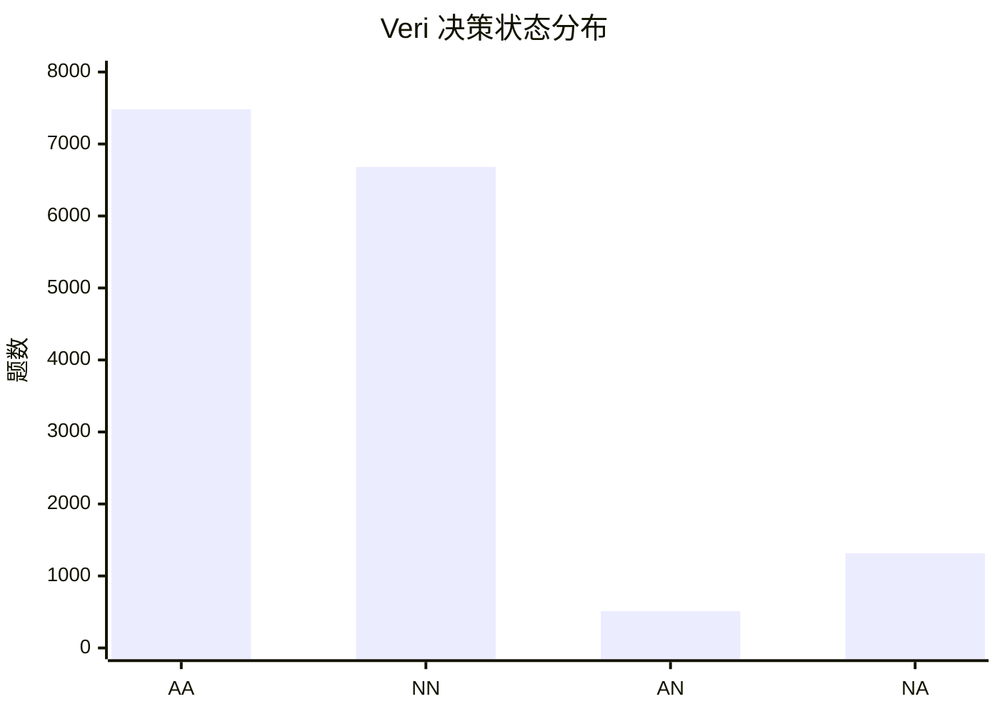

# Veri NN 纯决策统计报告

**报告日期：** 2026-08-25  
**评估运行：** `20260820-122750-veri-judge-gpt-4o-mini`  
**被测系统：** Veri  
**统计口径：** 仅使用 `expected_answered` 和 `actual_answered`，不使用 Correctness 分数或拒答文案  
**逐题明细：** [veri_nn_decision_analysis.json](veri_nn_decision_analysis.json)

## 一、结论

Veri 的 NN 数量是 **6,681**，NN 成功率是 **83.54%**，不是 28.72%。

计算方式：

```text
NN = expected_answered=false 且 actual_answered=false
NN 成功率 = NN / (NN + NA) = 6,681 / 7,997 = 83.54%
```

只要 Veri 对本应拒答的问题选择拒答，就计为 NN；拒答是否解释原因、解释是否具体、Correctness 是否达到 0.7，均不影响 NN 计数。

NN 没有达到 100% 的直接原因是另外 **1,316** 道本应拒答的问题被 Veri 判为可回答，形成 NA，占无答案题的 **16.46%**。

## 二、四种决策状态

本次运行共完成 15,991 道题。

| 状态 | expected_answered | actual_answered | 数量 | 占全部题目 |
| --- | ---: | ---: | ---: | ---: |
| AA | true | true | 7,482 | 46.79% |
| NN | false | false | **6,681** | **41.78%** |
| AN | true | false | 512 | 3.20% |
| NA | false | true | 1,316 | 8.23% |
| 合计 | - | - | 15,991 | 100.00% |



关键决策指标如下：

| 指标 | 公式 | 结果 |
| --- | --- | ---: |
| NN 成功率 | `NN / (NN + NA)` | **83.54%** |
| NA 率 | `NA / (NN + NA)` | 16.46% |
| 有答案题成功作答率 | `AA / (AA + AN)` | 93.60% |
| AN 错误拒答率 | `AN / (AA + AN)` | 6.40% |
| 拒答精确率 | `NN / (NN + AN)` | 92.88% |
| 决策准确率 | `(AA + NN) / Total` | 88.57% |

## 三、为什么 NN 是 83.54% 而不是 100%

### 3.1 唯一直接原因：1,316 个 NA

在 7,997 道 `expected_answered=false` 的题目中：

- 6,681 道被 Veri 拒答，计为 NN；
- 1,316 道被 Veri 作答，计为 NA。

因此，降低 NN 成功率的是 NA，不是 NN 的拒答措辞，也不是拒答文本的 Correctness 分数。

### 3.2 NA 输出确实以作答形式呈现

1,316 个 NA 全部包含以下结构：

- `【Answer】`
- `【Cited passage】`
- `【Source】`
- `【Source index】`

其输出平均长度约 704 字符，中位数约 552 字符。只有极少数输出包含明显的“无法回答”或“没有相关信息”措辞。因此这些样本按当前 Boolean 结果计为 NA 是一致的，不是因为拒答没有解释原因而被改算为 NA。

### 3.3 多数 NA 引用了评估上下文中的信息

对 NA 输出的 `【Cited passage】` 做空白归一化后进行字面匹配：

| 引用位置 | 数量 | 占 NA |
| --- | ---: | ---: |
| 可在 JSON `retrieval_context` 中找到 | 1,026 | 77.96% |
| 只可在完整 TXT 的额外内容中找到 | 18 | 1.37% |
| 未能字面匹配 | 268 | 20.36% |
| 无法解析或标为无相关段落 | 4 | 0.30% |

未能字面匹配不等于没有依据，因为输出可能对原文做了改写。该统计只用于定位输入边界，不能替代逐题语义复核。

77.96% 的 NA 引用能在 `retrieval_context` 中直接找到，说明主要矛盾是**可回答性边界**：数据集认为材料不足以回答完整问题，但 Veri 根据相关、部分或可推断的信息选择了作答。这里可能同时包含 Veri 判断过宽和题目标签边界有争议两种情况，需要抽样人工复核。

### 3.4 完整 TXT 输入会增加 NA，但不是全部原因

Veri 作答时使用完整 Wikipedia TXT，而评估契约要求使用 JSON 保存的 `retrieval_context`。按两类文档分组：

| 输入边界 | 无答案题 | NN | NA | NN 成功率 | NA 率 |
| --- | ---: | ---: | ---: | ---: | ---: |
| TXT 与 `retrieval_context` 一致 | 7,600 | 6,412 | 1,188 | 84.37% | 15.63% |
| TXT 长于 `retrieval_context` | 397 | 269 | 128 | 67.76% | 32.24% |

完整 TXT 更长的文档组，NA 率比输入一致组高 16.61 个百分点，说明输入不一致会放大 NA。但只有 18 个 NA 的引用被明确定位到 TXT 额外内容，因此不能把全部 1,316 个 NA 都归因于完整 TXT。

## 四、与 NN Correctness 的关系

本报告不使用 NN Correctness 判断是否为 NN。

旧分析中的 28.72% 是“6,681 个 NN 的文本通过 Correctness 0.7 阈值的比例”，不是 NN 成功率。按本次纯决策口径：

- 拒答文本再简短，只要 `actual_answered=false`，就计为 NN；
- 拒答文本没有解释原因，不会把 NN 改成 NA；
- NN Correctness 只影响当前流水线的 `case_passed`，不改变 AA、NN、AN、NA 状态。

因此，后续汇报应将“NN 决策成功率 83.54%”和“NN 文本指标”完全分开，不再把后者称为正确拒答率。

## 五、典型 NA 现象

### 5.1 用部分信息回答更具体的问题

题目询问某建筑的“具体建筑风格”，标准答案认为材料只说明了 Cape style，信息不够具体；Veri 直接回答 Cape style。此类样本的争议点是材料中的相关信息是否足以满足问题，而不是拒答文案。

### 5.2 从描述推断未明确陈述的结论

题目询问机场是否运营国际航班，材料只称其为国内支线机场；Veri 据此回答“不运营国际航班”。标准答案认为材料没有明确说明。此类 NA 来自 Veri 接受推断，而数据集要求显式证据。

### 5.3 从完整 TXT 获得截断范围外的信息

部分问题的答案不在 JSON `retrieval_context`，但在完整 TXT 后续段落中。Veri 使用完整 TXT 后给出答案，按照数据集保存的上下文仍会被标为 NA。这属于输入不一致，应先统一输入后再比较。

## 六、建议

1. **统一输入。** Veri 必须只使用 JSON 用例保存的 `retrieval_context`，避免完整 TXT 泄漏截断范围外的信息。
2. **复核 NA。** 从 1,316 个 NA 中按“上下文内直接引用、仅完整 TXT、未字面匹配”分层抽样，区分 Veri 判断过宽与标签边界争议。
3. **明确可回答标准。** 约定是否允许基于类别、时间关系或常识作推断，以及部分信息能否回答更具体的问题。
4. **单独治理 AN。** 512 个 AN 是材料有答案但 Veri 拒答，错误拒答率为 6.40%，与 NN 统计是另一类问题。
5. **固定报表口径。** NN 一律按 Boolean 决策统计；Correctness、Faithfulness 和 Relevancy 仅作为质量指标，不参与 NN 数量和 NN 成功率计算。

## 七、最终判断

Veri 在本次 15,991 道完成用例中有 **6,681 个 NN**；在 7,997 道本应拒答的问题上，**NN 成功率为 83.54%**。

NN 未达到 100% 的原因是 **1,316 个 NA**，即 Veri 对本应拒答的问题给出了答案。现有证据显示，主要需要检查可回答性边界和题目标签一致性；完整 TXT 输入不一致会放大问题，但只解释其中一部分。拒答是否提供原因不影响 NN 计数。