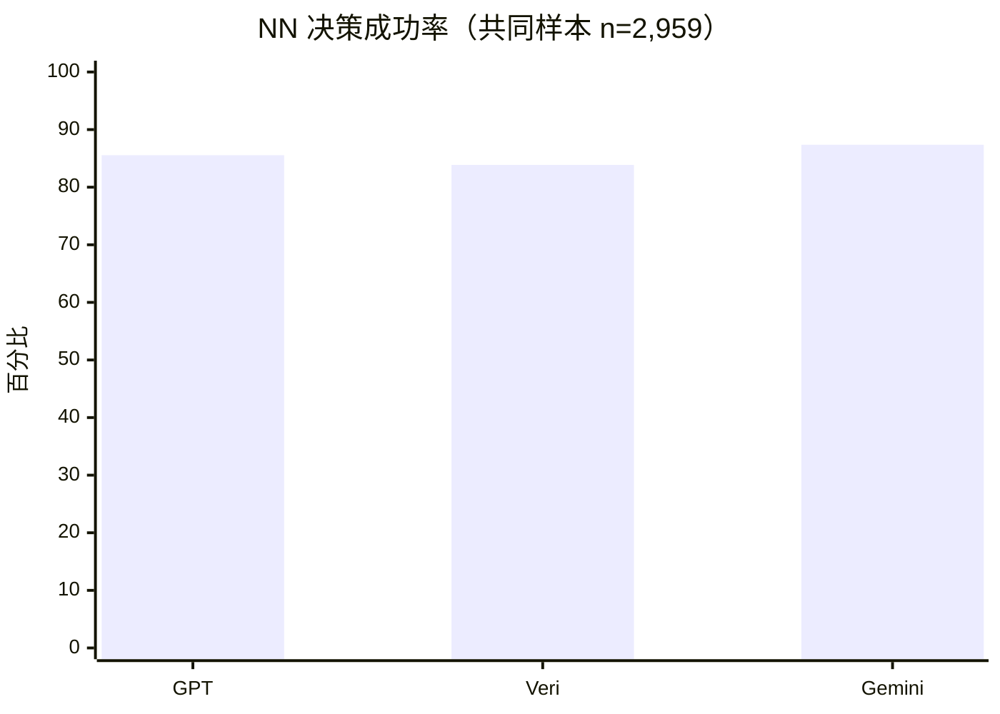
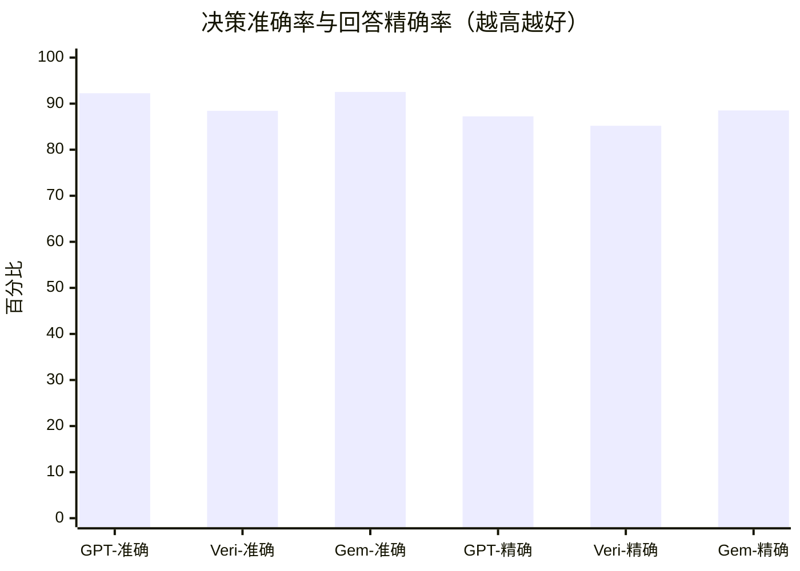
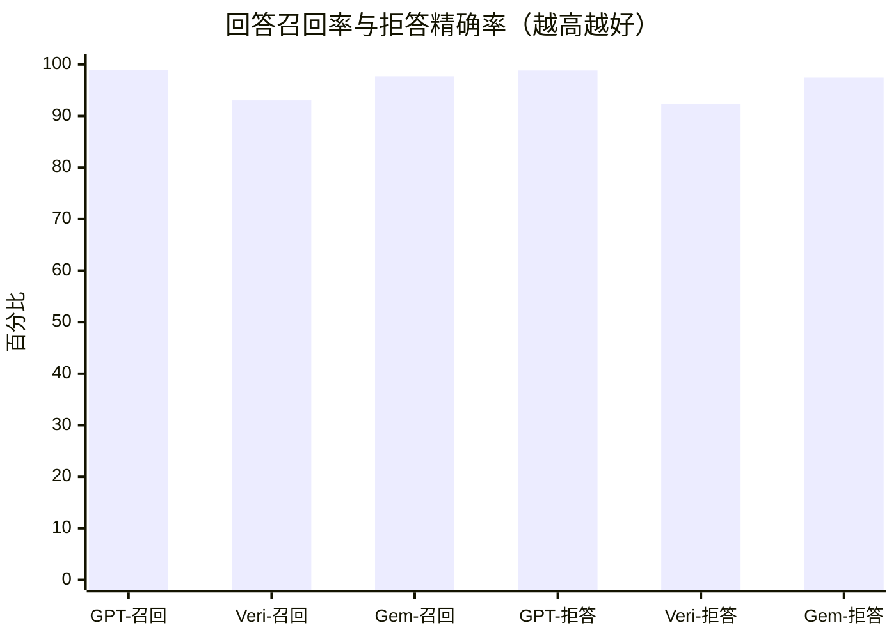
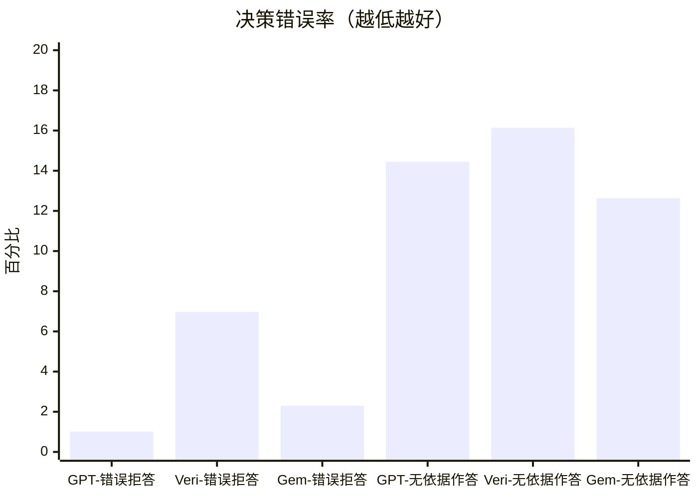
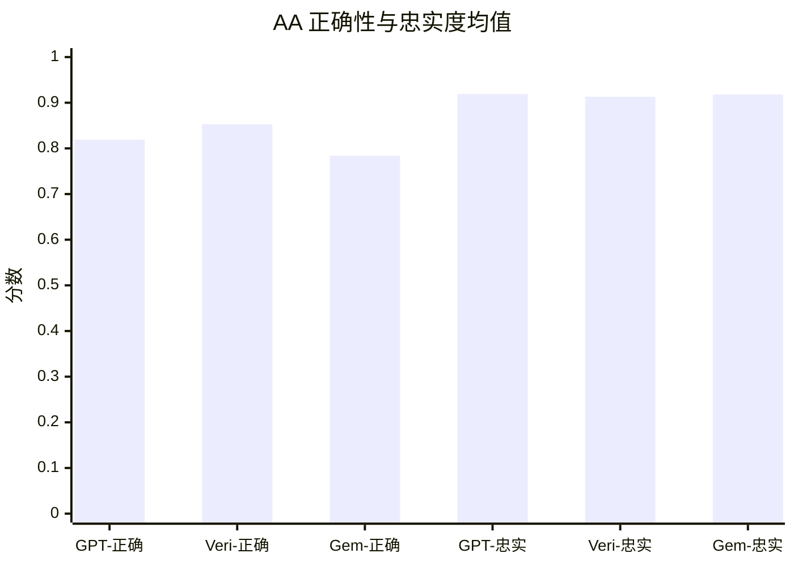
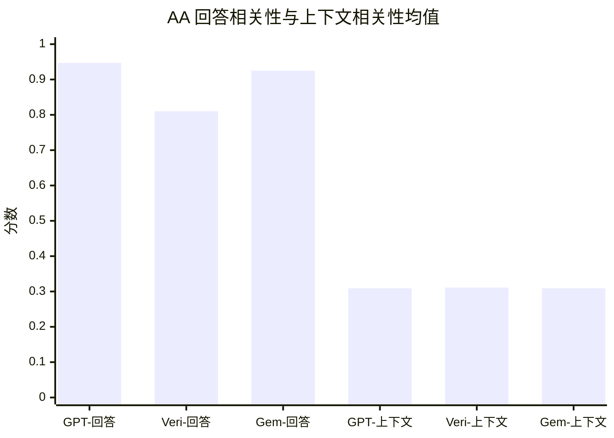
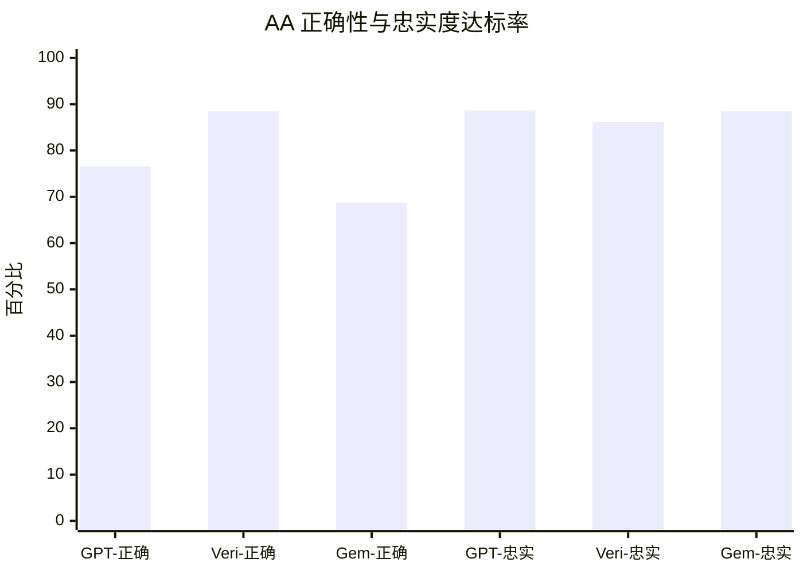
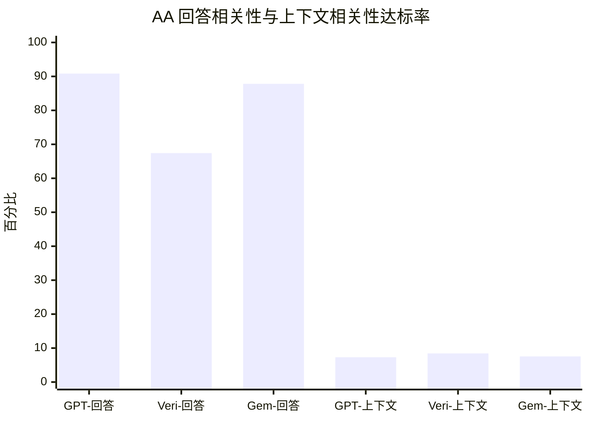
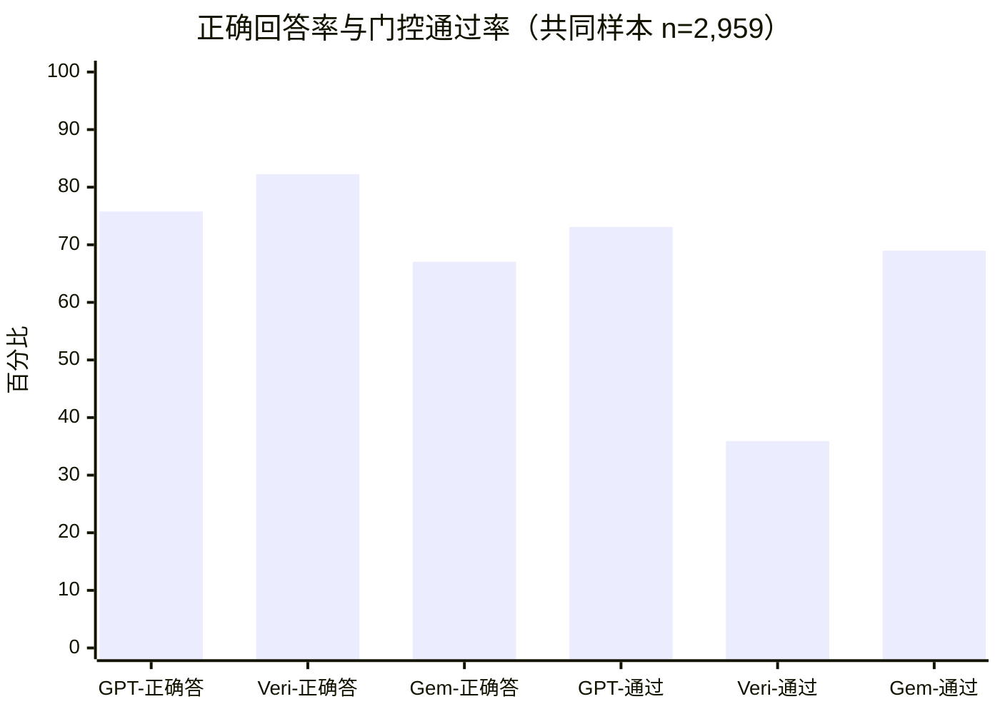

# Veri、Gemini 与 GPT 问答评估对比报告

**报告日期：** 2026-08-25  
**评估对象：** Veri、Gemini 3.5 Flash、GPT-4o-mini  
**裁判模型：** GPT-4o-mini  
**指标阈值：** 0.7  
**主比较样本：** 三模型共同成功评估的 2,959 道同题用例  
**结论性质：** 阶段性结论，用于模型优化和下一轮选型验证

## 一、先看结论

1. **Veri 的正确回答能力最强。** 在共同样本中，Veri 的 AA Correctness 均值为 0.853，正确回答率为 82.27%，均为三者最高。
2. **Gemini 的回答/拒答决策整体最好。** Decision Accuracy 为 92.53%，NN 决策成功率为 87.37%，无依据作答率为 12.63%。
3. **GPT 最少漏答。** 错误拒答率仅 1.01%，Answer Recall 为 98.99%，门控通过率为 73.10%，三项均为最佳。
4. **三模型忠实度接近。** AA Faithfulness 均值为 GPT 0.919、Gemini 0.918、Veri 0.913，差异很小。
5. **Veri 的主要问题是回答边界和输出冗长。** 其错误拒答率为 6.97%、无依据作答率为 16.14%、AA Answer Relevancy 为 0.810；Veri 的 NN 决策成功率是 83.86%。
6. **Veri 的审计能力最好。** 2,959 条共同样本输出全部包含回答、引用段落、来源和来源索引，但平均输出长度约为 GPT/Gemini 的 4.2 倍。

## 二、阅读口径

### 2.1 三层指标不要混用

| 层次 | 回答的问题 | 主要指标 |
| --- | --- | --- |
| 决策层 | 模型是否该答时答、该拒时拒 | AA、NN、AN、NA、Decision Accuracy、NN 决策成功率 |
| 回答质量层 | 模型实际作答后，答案质量如何 | Correctness、Faithfulness、Answer Relevancy |
| 端到端层 | 从决策到答案质量，最终有多少题成功 | Correct Answer Rate、门控通过率 `case_passed` |

> **NN 口径：** NN 只由 `expected_answered=false` 且 `actual_answered=false` 决定。NN 决策成功率只按 `NN / (NN + NA)` 计算，不使用 Correctness 分数，也不要求拒答解释原因。

### 2.2 三种样本范围

| 样本范围 | 数量 | 用途 | 是否用于主排名 |
| --- | ---: | --- | --- |
| 共同样本 | 2,959 | 三模型同题横向比较 | **是** |
| 同上下文子集 | 2,799 | 排除 Veri 完整 TXT 输入差异 | 稳健性检查 |
| 各自运行结果 | GPT 15,980；Veri 15,991；Gemini 2,963 | 查看单次运行规模和方向 | **否，样本覆盖不同** |

后文所有主排名均使用 2,959 道共同样本。共同样本包含 1,478 道有答案题和 1,481 道无答案题。

## 三、共同样本：回答与拒答决策

### 3.1 状态定义

| 状态 | expected_answered | actual_answered | 含义 |
| --- | ---: | ---: | --- |
| AA | true | true | 材料有答案，模型作答；决策正确，但答案未必正确 |
| NN | false | false | 材料无答案，模型拒答；决策正确 |
| AN | true | false | 材料有答案，模型错误拒答 |
| NA | false | true | 材料无答案，模型仍作答 |

### 3.2 状态数量

| 模型 | AA | NN | AN | NA |
| --- | ---: | ---: | ---: | ---: |
| Gemini 3.5 Flash | 1,444 | **1,294** | 34 | **187** |
| GPT-4o-mini | **1,463** | 1,267 | **15** | 214 |
| Veri | 1,375 | 1,242 | 103 | 239 |

### 3.3 核心决策率

| 模型 | Decision Accuracy | 错误拒答率 | NN 决策成功率 | 无依据作答率 |
| --- | ---: | ---: | ---: | ---: |
| Gemini 3.5 Flash | **92.53%** | 2.30% | **87.37%** | **12.63%** |
| GPT-4o-mini | 92.26% | **1.01%** | 85.55% | 14.45% |
| Veri | 88.44% | 6.97% | 83.86% | 16.14% |

### 3.4 精确率与召回率

| 模型 | Answer Precision | Answer Recall | Abstention Precision |
| --- | ---: | ---: | ---: |
| Gemini 3.5 Flash | **88.53%** | 97.70% | 97.44% |
| GPT-4o-mini | 87.24% | **98.99%** | **98.83%** |
| Veri | 85.19% | 93.03% | 92.34% |

指标公式：

- Decision Accuracy = `(AA + NN) / Total`
- 错误拒答率 = `AN / (AA + AN)`
- NN 决策成功率 = `NN / (NN + NA)`
- 无依据作答率 = `NA / (NN + NA)`
- Answer Precision = `AA / (AA + NA)`
- Answer Recall = `AA / (AA + AN)`
- Abstention Precision = `NN / (NN + AN)`

NN 决策成功率与无依据作答率互为补数。三模型 NN 决策成功率相差不大，最高的 Gemini 与 Veri 相差 3.51 个百分点。

**如何理解：** Gemini 的整体决策准确率和 NN 决策成功率最高；GPT 最少错误拒答；Veri 的 AN 和 NA 都更多，因此需要校准“答还是不答”的边界。

## 四、共同样本：实际作答质量

本节只统计 AA，即“材料有答案且模型选择作答”的题目。NN 不进入本节。

### 4.1 质量均值

| 模型 | Correctness | Faithfulness | Answer Relevancy | Contextual Relevancy |
| --- | ---: | ---: | ---: | ---: |
| GPT-4o-mini | 0.819 | **0.919** | **0.947** | 0.309 |
| Veri | **0.853** | 0.913 | 0.810 | **0.311** |
| Gemini 3.5 Flash | 0.784 | 0.918 | 0.925 | 0.309 |

### 4.2 质量达标率（阈值 0.7）

| 模型 | Correctness | Faithfulness | Answer Relevancy | Contextual Relevancy |
| --- | ---: | ---: | ---: | ---: |
| GPT-4o-mini | 76.56% | **88.65%** | **90.84%** | 7.31% |
| Veri | **88.44%** | 86.11% | 67.42% | **8.44%** |
| Gemini 3.5 Flash | 68.63% | 88.50% | 87.81% | 7.55% |

**如何理解：** Veri 的答案与标准答案最一致，GPT 的回答最直接，三者忠实度基本相同。Contextual Relevancy 约为 0.31，是因为相同的长材料中包含大量与单题无关的段落；本流程没有独立检索器，因此该指标只作诊断，不参与门控通过率。

## 五、共同样本：端到端结果

| 模型 | 正确回答率 | 正确题数 / 有答案题 | 门控通过率 | 通过题数 / 全部题 |
| --- | ---: | ---: | ---: | ---: |
| Veri | **82.27%** | **1,216 / 1,478** | 35.92% | 1,063 / 2,959 |
| GPT-4o-mini | 75.78% | 1,120 / 1,478 | **73.10%** | **2,163 / 2,959** |
| Gemini 3.5 Flash | 67.05% | 991 / 1,478 | 68.98% | 2,041 / 2,959 |

- **正确回答率（Correct Answer Rate）**：在所有有答案题中，模型选择作答且 Correctness 达标的比例。
- **门控通过率（Case Pass Rate）**：决策正确，并通过当前流程中所有适用质量门控的比例。

Veri 的正确回答率最高，但门控通过率最低。这说明 Veri 真正作答时的正确性较强，而输出相关性和当前 NN 文本门控会降低 `case_passed`；NN 决策能力应单独使用第三节的纯决策指标判断。

## 六、模型画像

| 模型 | 主要优势 | 主要风险 | 更适合的侧重点 |
| --- | --- | --- | --- |
| GPT-4o-mini | 错误拒答最少、回答相关性最高、门控通过率最高 | 无依据作答率高于 Gemini；被测模型与裁判相同 | 综合可用性、低漏答 |
| Veri | 正确回答率最高、Correctness 最强、证据链完整 | 回答边界偏宽且漏答更多；输出较长；历史运行输入不完全一致 | 知识库问答、审计与溯源 |
| Gemini 3.5 Flash | 决策准确率最高、无依据作答率最低、回答简洁 | Correctness 和正确回答率最低；当前只覆盖题库前缀 | 风险控制、低无依据作答 |

补充说明：

- Veri 的 2,959 条共同样本输出均包含 `【Answer】`、`【Cited passage】`、`【Source】`、`【Source index】`。
- Veri 平均输出 516 字符、中位数 443 字符；GPT 平均 121 字符、中位数 99 字符；Gemini 平均 125 字符、中位数 100 字符。
- GPT 同时担任被测模型和裁判模型，正式选型需要增加独立裁判或人工复核。

## 七、稳健性与可比性

### 7.1 同上下文子集（2,799 题）

Veri 历史运行上传完整 Wikipedia TXT，GPT/Gemini 使用 JSON 中的 `retrieval_context`。共同样本中有 160 题的完整 TXT 长于 `retrieval_context`；排除这些题后得到 2,799 道同上下文用例。

**决策与端到端结果**

| 模型 | Decision Accuracy | 错误拒答率 | 无依据作答率 | 正确回答率 | 门控通过率 |
| --- | ---: | ---: | ---: | ---: | ---: |
| GPT-4o-mini | **92.78%** | **1.07%** | 13.35% | 75.75% | **73.88%** |
| Veri | 89.00% | 6.80% | 15.20% | **82.90%** | 35.98% |
| Gemini 3.5 Flash | 92.71% | 2.43% | **12.13%** | 67.38% | 69.49% |

**AA 质量均值**

| 模型 | Correctness | Faithfulness | Answer Relevancy |
| --- | ---: | ---: | ---: |
| GPT-4o-mini | 0.818 | **0.922** | **0.946** |
| Veri | **0.855** | 0.916 | 0.805 |
| Gemini 3.5 Flash | 0.785 | **0.922** | 0.923 |

同上下文子集与共同样本方向一致：Veri 的正确性和正确回答率仍最高；GPT/Gemini 的决策表现更好。后续受控复测仍应让三个系统使用完全相同的 `retrieval_context`。

### 7.2 各自运行结果（不可横向排名）

下表样本覆盖不同：GPT/Veri 接近 16,000 题，Gemini 只有题库开头约 3,000 题。该表只能确认各模型单次运行的方向，不能直接用于模型排名。

**运行规模与端到端结果**

| 模型 | 成功样本 | Decision Accuracy | 正确回答率 | 门控通过率 |
| --- | ---: | ---: | ---: | ---: |
| GPT-4o-mini | 15,980 | 91.73% | 75.00% | 72.33% |
| Veri | 15,991 | 88.57% | **81.66%** | 35.69% |
| Gemini 3.5 Flash | 2,963 | **92.54%** | 67.05% | 68.98% |

**AA 质量均值**

| 模型 | Correctness | Faithfulness | Answer Relevancy |
| --- | ---: | ---: | ---: |
| GPT-4o-mini | 0.815 | **0.918** | **0.940** |
| Veri | **0.849** | 0.913 | 0.811 |
| Gemini 3.5 Flash | 0.784 | **0.918** | 0.925 |

## 八、运行成本与稳定性

| 模型 | 裁判响应数 | Prompt Tokens | Completion Tokens | 总 Tokens | 每成功用例 Tokens |
| --- | ---: | ---: | ---: | ---: | ---: |
| GPT-4o-mini | 175,895 | 79,936,884 | 22,065,239 | 102,002,123 | 6,383 |
| Veri | 175,960 | 89,264,927 | 24,891,823 | 114,156,750 | 7,139 |
| Gemini 3.5 Flash | 32,592 | 14,864,522 | 4,128,245 | 18,992,767 | 6,410 |

Token 汇总只覆盖 DeepEval 裁判请求，不包含三个被测系统生成答案的成本。Veri 每成功用例的裁判 Token 比 GPT 高约 11.8%，主要与更长的回答和引用内容有关。

三次运行技术失败率均低于 0.13%。GPT 成功评估 15,980 题、技术失败 20 题；Veri 成功 15,991 题、失败 9 题；Gemini 成功 2,963 题、失败 2 题。

## 九、建议行动

1. **统一输入后复测。** 三个系统只使用 JSON 保存的 `retrieval_context`，排除完整 TXT 带来的信息优势或标签冲突。
2. **校准 Veri 的回答边界。** 分层复核共同样本的 103 个 AN 和 239 个 NA，以及全量的 512 个 AN 和 1,316 个 NA。
3. **精简 Veri 输出。** 主答案只保留直接回答和最小支持段落，完整证据作为独立审计字段，降低 Answer Relevancy 和 Token 成本。
4. **固定 NN 报表口径。** NN 决策成功率始终使用 `NN / (NN + NA)`；共同样本为 83.86%，Veri 全量为 83.54%。
5. **增加独立裁判和人工复核。** 使用非候选模型复判，并人工抽查高分、低分和决策分歧样本。
6. **补齐 Gemini 覆盖。** 采用固定 seed 的分层随机样本，或完成全部 16,000 题，验证当前结论的代表性。

**阶段性选型判断：** 若优先正确回答和证据链，Veri 最有优势；若优先综合门控和低漏答，GPT 当前最好；若优先减少无依据作答，Gemini 当前最好。正式选型前应先完成统一输入、独立裁判和 Gemini 覆盖补齐。