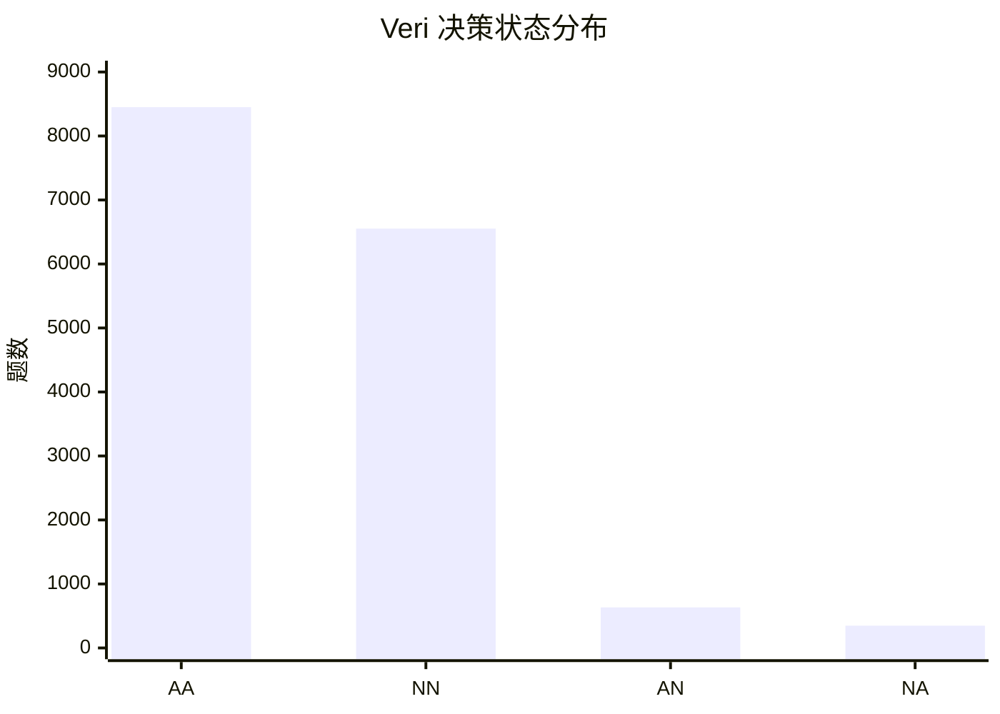
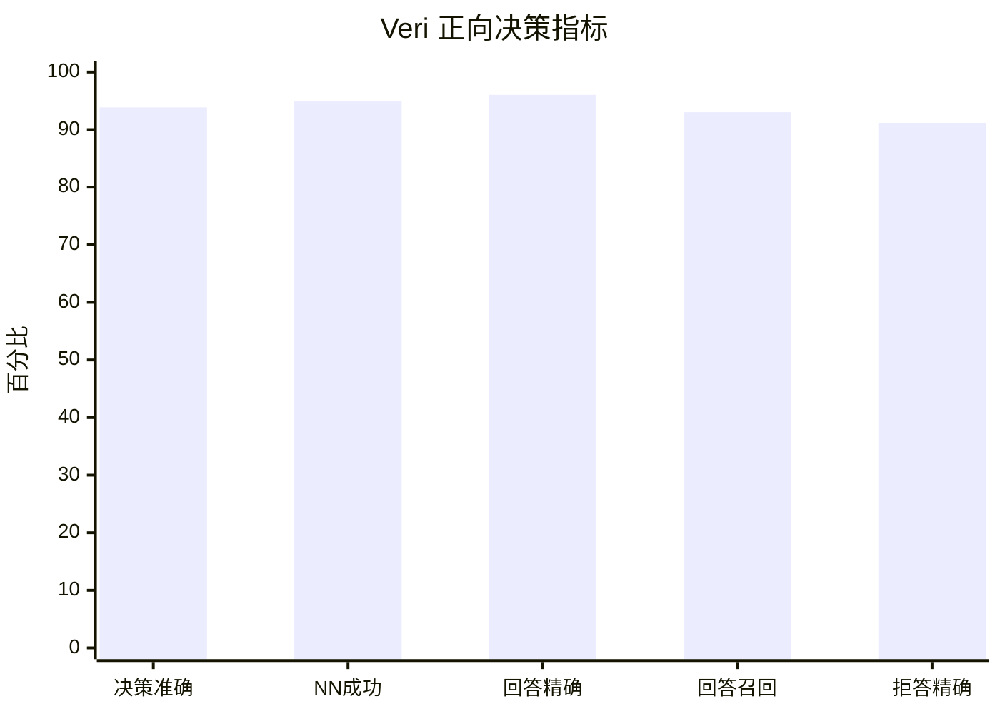
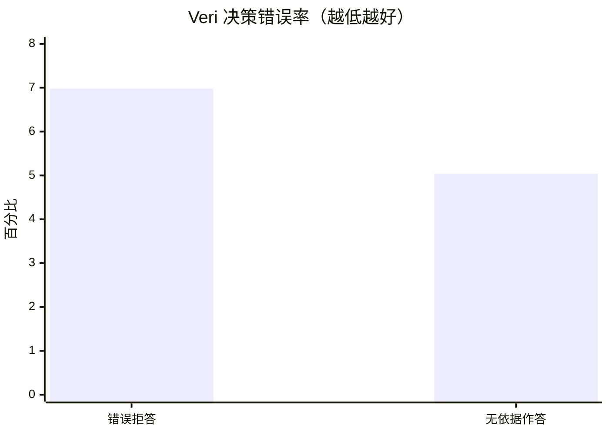
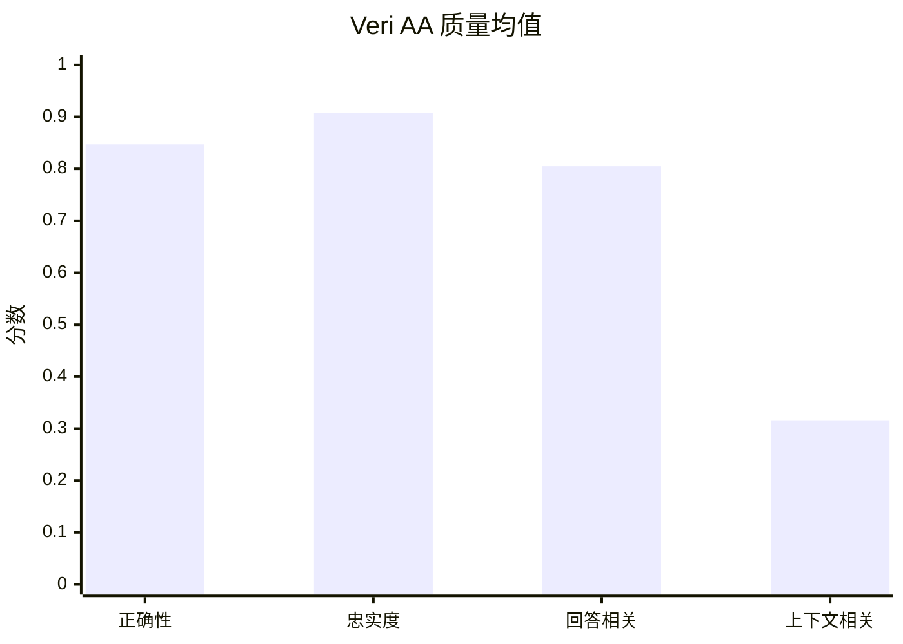
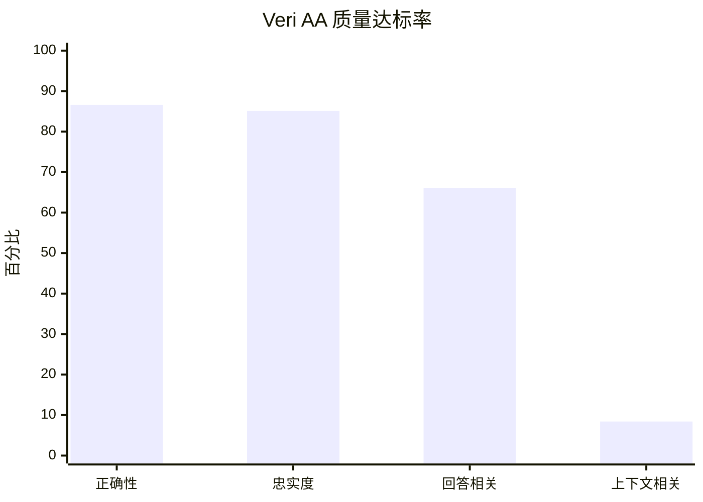
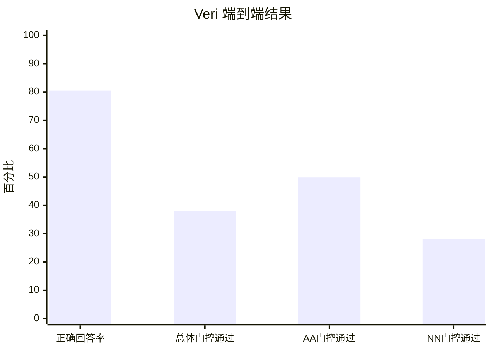

# Veri 单模型评估报告

**评估运行：** `20260830-122059-veri-judge-gpt-4o-mini`  
**被测系统：** Veri  
**裁判模型：** GPT-4o-mini  
**指标阈值：** 0.7  
**计划用例：** 16,000 题  
**成功评估：** 15,985 题（99.91%）

## 一、结论摘要

1. **Veri 的回答/拒答决策总体良好。** Decision Accuracy 为 **93.86%**，15,985 道成功用例中有 15,003 道决策正确。
2. **对无答案题的拒答表现较强。** 6,901 道本应拒答的问题中，Veri 拒答 6,553 道，NN 决策成功率为 **94.96%**；其余 348 道为 NA。
3. **对有答案题仍存在一定漏答。** 9,084 道有答案题中，Veri 作答 8,450 道，Answer Recall 为 **93.02%**；634 道为 AN，错误拒答率为 **6.98%**。
4. **实际作答的正确性较强，但回答不够精简。** AA Correctness 均值为 **0.847**、达标率为 **86.60%**；AA Answer Relevancy 均值为 **0.805**、达标率仅 **66.13%**，是最明显的质量短板。
5. **证据结构完整但输出较长。** 15,985 条输出全部包含回答、引用段落、来源和来源索引；平均长度约 517 字符，中位数为 436 字符。
6. **本轮提升主要来自参考答案修订。** 与 `20260820-122750-veri-judge-gpt-4o-mini` 的共同用例相比，Veri 输出没有变化，但 1,157 道题的 `expected_answered` 标签发生变化，因此不能把决策指标提升解释为模型能力升级。

## 二、统计口径

### 2.1 决策状态

| 状态 | expected_answered | actual_answered | 含义 |
| --- | ---: | ---: | --- |
| AA | true | true | 材料有答案，Veri 作答 |
| NN | false | false | 材料无答案，Veri 拒答 |
| AN | true | false | 材料有答案，Veri 错误拒答 |
| NA | false | true | 材料无答案，Veri 仍然作答 |

> **NN 只按 Boolean 决策统计。** 只要 `expected_answered=false` 且 `actual_answered=false`，就计为 NN；拒答是否解释原因、文本 Correctness 是否达标，均不改变 NN 状态。

### 2.2 关键公式

- Decision Accuracy = `(AA + NN) / Total`
- 错误拒答率 = `AN / (AA + AN)`
- NN 决策成功率 = `NN / (NN + NA)`
- 无依据作答率 = `NA / (NN + NA)`
- Answer Precision = `AA / (AA + NA)`
- Answer Recall = `AA / (AA + AN)`
- Abstention Precision = `NN / (NN + AN)`

质量指标只在相应状态内解释。AA 用于分析实际答案质量；Contextual Relevancy 只作诊断，不参与 `case_passed`。

## 三、运行完成情况

| 项目 | 数量 | 比例 |
| --- | ---: | ---: |
| 计划用例 | 16,000 | 100.00% |
| 成功评估 | 15,985 | 99.91% |
| 技术失败 | 15 | 0.09% |
| 完成的指标响应 | 63,944 | 99.91% |

本次运行状态为 `completed_with_errors`。15 个技术失败用例不进入决策和质量指标分母，技术失败率较低，对总体结论影响有限。

## 四、回答与拒答决策

### 4.1 状态分布

| 状态 | 数量 | 占成功用例 |
| --- | ---: | ---: |
| AA | 8,450 | 52.86% |
| NN | 6,553 | 40.99% |
| AN | 634 | 3.97% |
| NA | 348 | 2.18% |
| 合计 | 15,985 | 100.00% |

### 4.2 决策指标

| 指标 | 分子 / 分母 | 结果 | 方向 |
| --- | ---: | ---: | --- |
| Decision Accuracy | 15,003 / 15,985 | **93.86%** | 越高越好 |
| NN 决策成功率 | 6,553 / 6,901 | **94.96%** | 越高越好 |
| 错误拒答率 | 634 / 9,084 | 6.98% | 越低越好 |
| 无依据作答率 | 348 / 6,901 | 5.04% | 越低越好 |
| Answer Precision | 8,450 / 8,798 | 96.04% | 越高越好 |
| Answer Recall | 8,450 / 9,084 | 93.02% | 越高越好 |
| Abstention Precision | 6,553 / 7,187 | 91.18% | 越高越好 |

**判断：** Veri 对无答案题的处理优于对有答案题的覆盖。NA 只有 348 道，而 AN 有 634 道；下一步应优先检查错误拒答，同时避免为了降低 AN 而放宽回答边界、重新增加 NA。

## 五、实际作答质量

本节只统计 8,450 个 AA，即材料有答案且 Veri 实际作答的用例。

### 5.1 质量均值

| 指标 | 均值 | 说明 |
| --- | ---: | --- |
| Correctness | **0.847** | 与参考答案的事实一致性较强 |
| Faithfulness | **0.908** | 大多数回答得到上下文支持 |
| Answer Relevancy | 0.805 | 回答中较常出现问题未要求的信息 |
| Contextual Relevancy | 0.316 | 长上下文包含较多与单题无关内容，仅作诊断 |

### 5.2 质量达标率

| 指标 | 达标题数 / AA | 达标率 |
| --- | ---: | ---: |
| Correctness | 7,318 / 8,450 | **86.60%** |
| Faithfulness | 7,193 / 8,450 | 85.12% |
| Answer Relevancy | 5,588 / 8,450 | 66.13% |
| Contextual Relevancy | 711 / 8,450 | 8.41% |

Answer Relevancy 有 2,862 道未达标，是 AA 中失败最多的质量项；Correctness 有 1,132 道未达标，Faithfulness 有 1,257 道未达标。Contextual Relevancy 不参与门控，因此其低分不应解释为 Veri 答案失败。

## 六、端到端结果

| 指标 | 分子 / 分母 | 结果 |
| --- | ---: | ---: |
| Correct Answer Rate | 7,318 / 9,084 | **80.56%** |
| Case Pass Rate | 6,061 / 15,985 | 37.92% |
| AA Case Pass Rate | 4,214 / 8,450 | 49.87% |
| NN Case Pass Rate | 1,847 / 6,553 | 28.19% |

- **Correct Answer Rate** 表示所有有答案题中，Veri 选择作答且 Correctness 达标的比例。
- **Case Pass Rate** 还要求决策正确并通过适用的质量门控，因此比 Correct Answer Rate 更严格。
- 当前流水线对 NN 文本仍应用 Correctness 门控，所以 NN Case Pass Rate 只有 28.19%；这只是门控结果，**不是 NN 决策成功率**。Veri 的 NN 决策成功率仍为 94.96%。

### 6.1 AA 门控失败结构

| 失败组合 | 题数 | 占 AA |
| --- | ---: | ---: |
| 全部门控通过 | 4,214 | 49.87% |
| 仅 Answer Relevancy 失败 | 2,110 | 24.97% |
| 仅 Correctness 失败 | 611 | 7.23% |
| 仅 Faithfulness 失败 | 592 | 7.01% |
| Answer Relevancy + Faithfulness 失败 | 402 | 4.76% |
| Answer Relevancy + Correctness 失败 | 258 | 3.05% |
| Correctness + Faithfulness 失败 | 171 | 2.02% |
| 三项均失败 | 92 | 1.09% |

仅 Answer Relevancy 失败的用例最多，说明精简答案和引用内容可能是提升门控通过率的最直接方向。

## 七、与上一轮 Veri 结果的关系

对比运行：`20260820-122750-veri-judge-gpt-4o-mini`。以下对比只用于解释指标变化，不代表模型重新生成了更好的回答。

### 7.1 指标变化

| 指标 | 2026-08-20 | 2026-08-30 | 变化 |
| --- | ---: | ---: | ---: |
| Decision Accuracy | 88.57% | **93.86%** | +5.29 个百分点 |
| NN 决策成功率 | 83.54% | **94.96%** | +11.41 个百分点 |
| 无依据作答率 | 16.46% | **5.04%** | -11.41 个百分点 |
| 错误拒答率 | 6.40% | 6.98% | +0.57 个百分点 |
| Correct Answer Rate | 81.66% | 80.56% | -1.10 个百分点 |
| Case Pass Rate | 35.69% | 37.92% | +2.23 个百分点 |

### 7.2 变化归因

两轮共同成功的 15,982 道用例中：

- `actual_answered` 变化：0 道；
- `actual_output` 变化：0 道；
- `retrieval_context` 变化：0 道；
- `expected_answered` 变化：1,157 道；
- `expected_output` 变化：1,219 道。

标签变化中，1,123 道从“无答案”改为“有答案”，34 道从“有答案”改为“无答案”。最主要的状态迁移是 968 道由 NA 变为 AA；另有 155 道由 NN 变为 AN。

因此，本轮 NN 决策成功率和 Decision Accuracy 的显著提升，主要来自参考答案和可回答性标签修订，使评估标准更符合已有回答；Veri 的实际输出并未改变。报告应把此次结果视为**修订后基准上的重新评估**，而不是模型版本升级后的前后对比。

## 八、输出与成本

### 8.1 输出结构

| 项目 | 覆盖数量 | 覆盖率 |
| --- | ---: | ---: |
| `【Answer】` | 15,985 | 100.00% |
| `【Cited passage】` | 15,985 | 100.00% |
| `【Source】` | 15,985 | 100.00% |
| `【Source index】` | 15,985 | 100.00% |

输出平均长度约 517 字符，中位数为 436 字符。完整证据链便于审计，但较长的引用和相邻信息会增加 Answer Relevancy 失败及裁判 Token 消耗。

### 8.2 裁判 Token

| 项目 | 数量 |
| --- | ---: |
| 裁判响应 | 175,924 |
| Prompt Tokens | 89,264,729 |
| Completion Tokens | 24,918,794 |
| 总 Tokens | 114,183,523 |
| 每成功用例 Tokens | 约 7,143 |

Token 汇总只包含 DeepEval 裁判请求，不包含 Veri 生成回答的成本。

## 九、风险与限制

1. **参考答案发生大规模修订。** 新旧结果不能直接作为模型能力提升实验；需要固定 golden 数据后再做模型版本对比。
2. **Veri 历史回答使用完整 Wikipedia TXT。** 参考答案依据 JSON `retrieval_context`，输入边界并不完全一致；下一轮应统一为同一上下文。
3. **GPT-4o-mini 是单一裁判。** 指标可能受裁判偏好和随机性影响，关键结论应增加独立裁判或人工复核。
4. **Case Pass Rate 对 NN 文本敏感。** 该指标不适合单独代表拒答能力；拒答能力应看 NN 决策成功率、无依据作答率和 Abstention Precision。
5. **15 个技术失败未进入统计。** 数量较少，但严格复现时仍应保留该范围说明。

## 十、建议行动

1. **优先复核 634 个 AN。** 按“上下文已有直接答案、只有部分证据、Boolean 重判争议”分层，降低错误拒答率。
2. **抽查 348 个 NA。** 区分 Veri 推断过度、完整 TXT 提供额外信息和参考标签仍有争议三种情况。
3. **精简 AA 输出。** 主答案只保留直接结论和最小支持段落，将完整来源索引保留为独立审计字段，优先改善 Answer Relevancy。
4. **统一输入后复测。** 所有系统只使用用例 JSON 保存的 `retrieval_context`，再建立可公平复现的新基线。
5. **冻结参考答案版本。** 保存用例文件指纹或版本号，避免后续把 golden 修订误判为模型改善。
6. **引入独立裁判和人工样本。** 对 AN、NA 和质量临界分数进行复判，验证指标稳定性。

**最终判断：** 在修订后的参考答案基准上，Veri 的决策准确率为 93.86%，NN 决策成功率为 94.96%，正确回答率为 80.56%。Veri 的优势是事实正确性、忠实度和完整证据链；主要改进方向是减少错误拒答、精简回答与引用，并在统一输入和冻结参考答案后重新建立可比较基线。