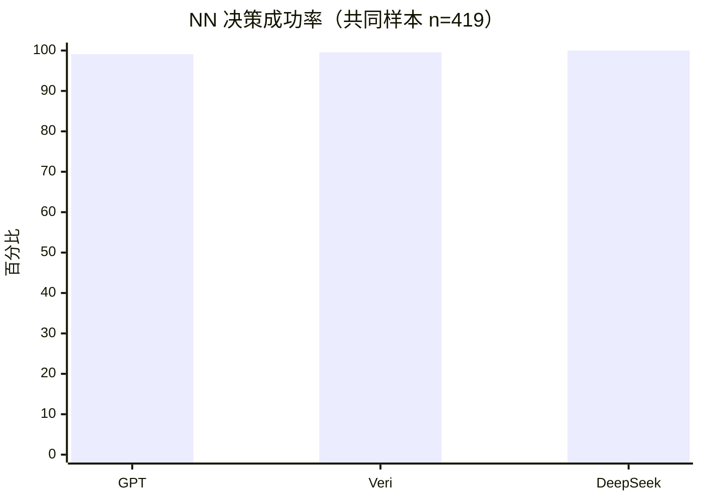
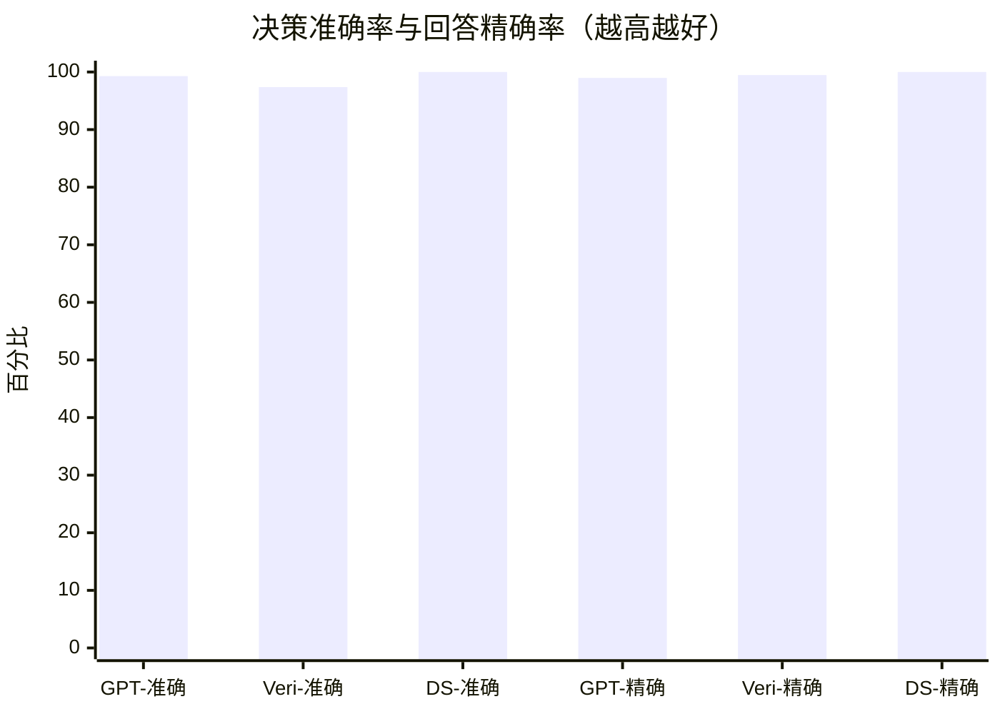
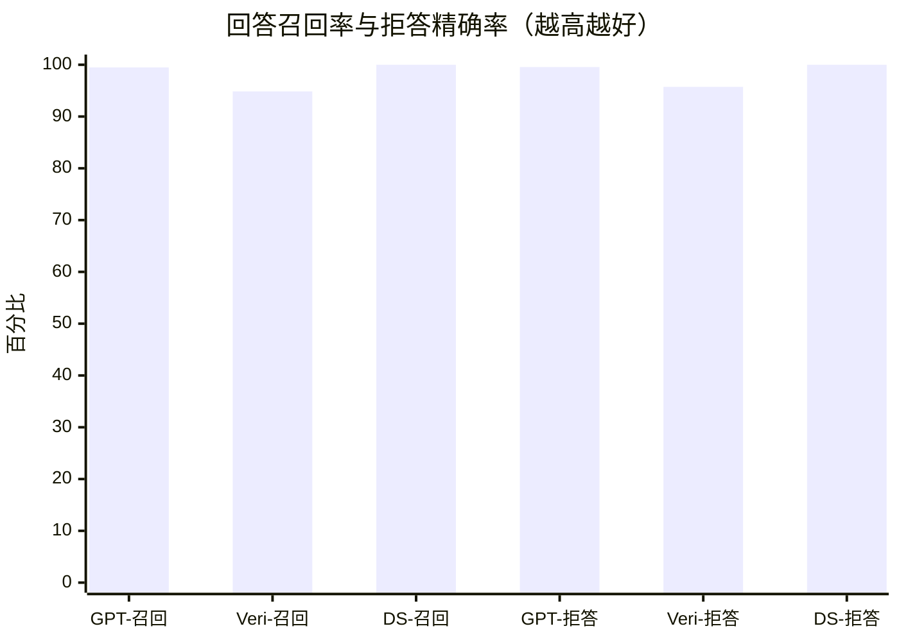
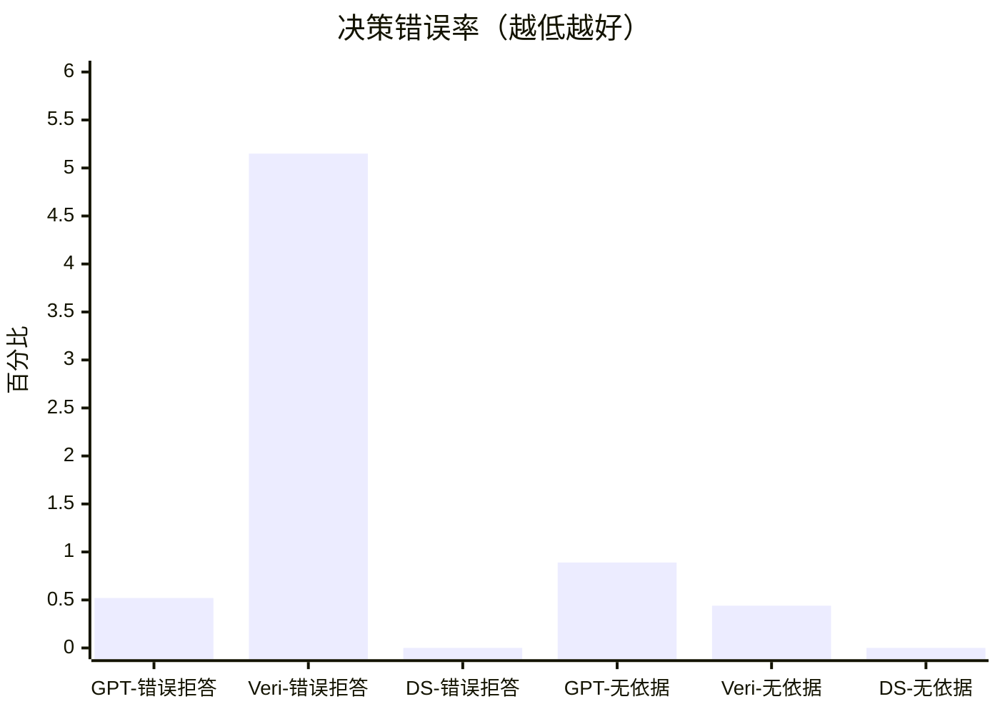
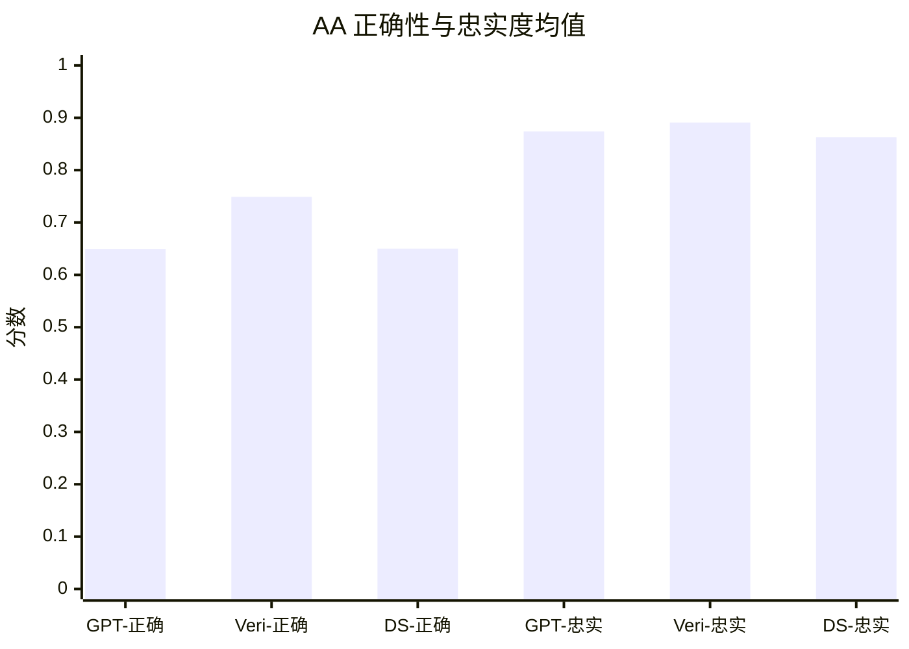
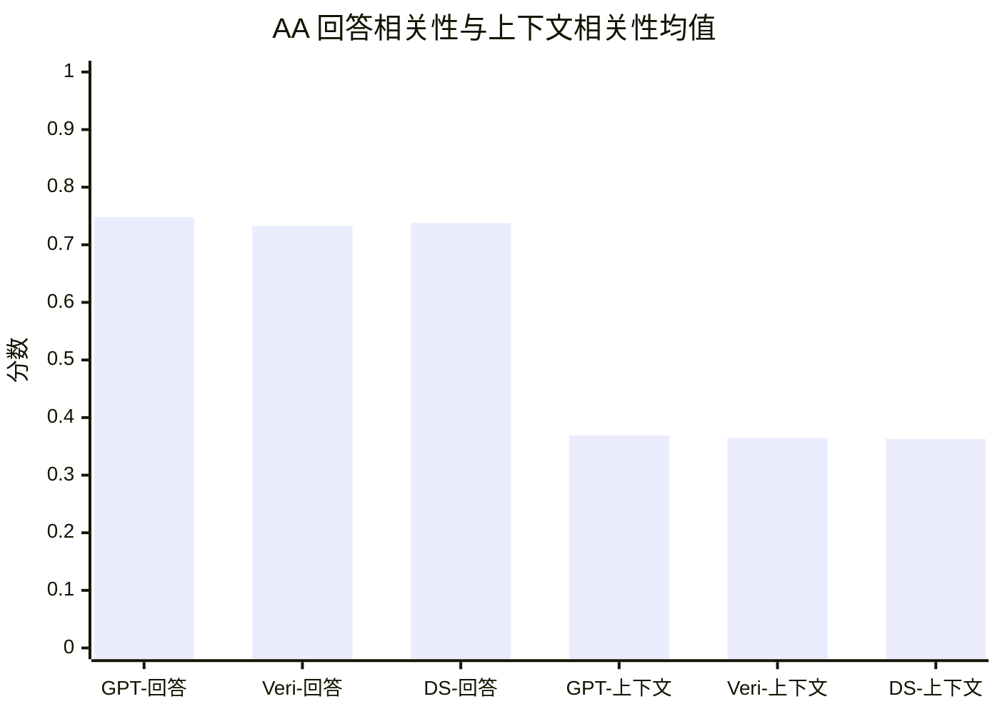
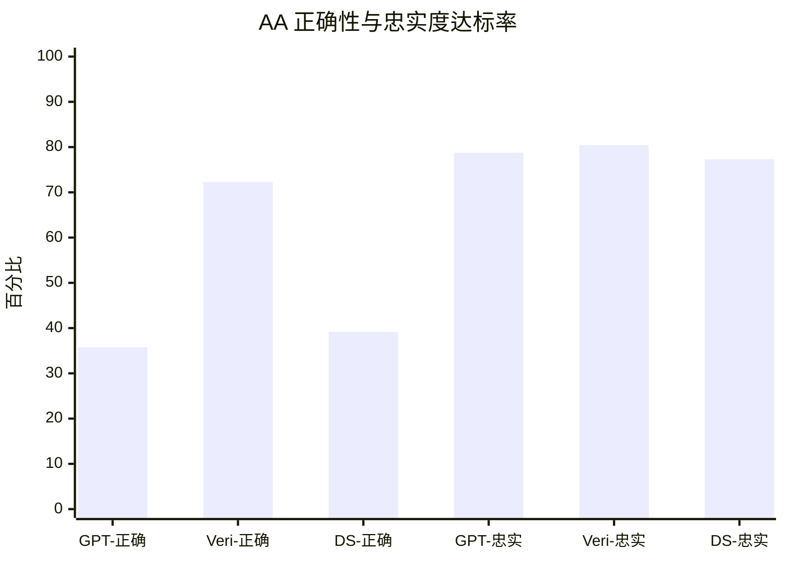
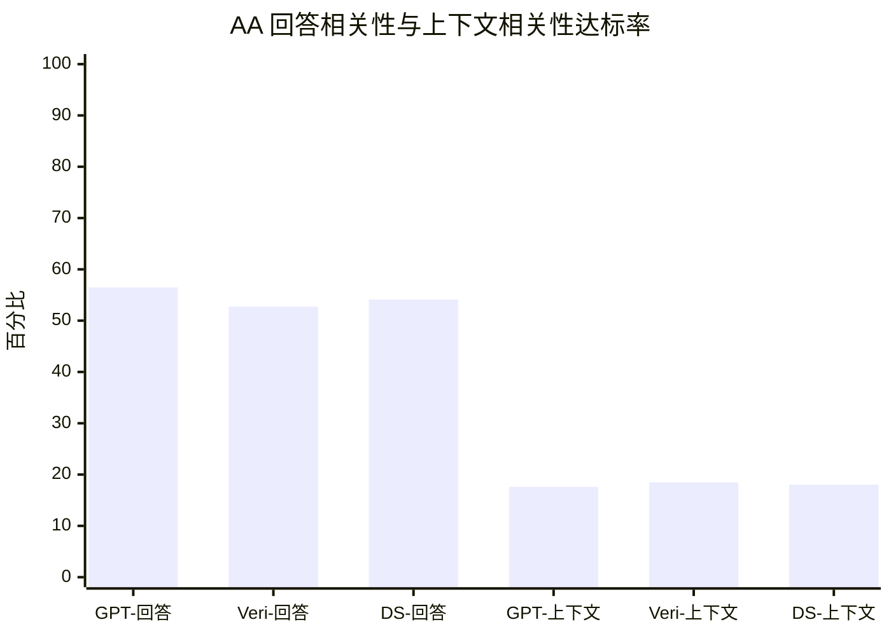
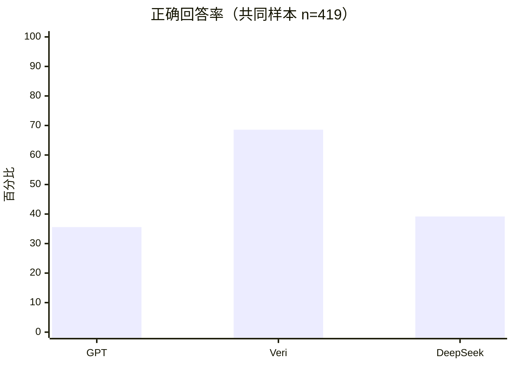

# GPT、Veri 与 DeepSeek 问答评估对比报告

**报告日期：** 2026-09-16  
**数据截点：** 2026-09-15 23:46 UTC  
**评估对象：** GPT-4o-mini、Veri、DeepSeek-V4.1-Flash  
**裁判模型：** GPT-4o-mini  
**指标阈值：** 0.7  
**主比较集：** 三模型共同成功完成的 419 道同题用例  
**结论性质：** 仅针对共同成功评估样本

## 一、先看结论

1. **DeepSeek 的回答/拒答决策最好。** 419 题中 AA 194、NN 225、AN 0、NA 0，Decision Accuracy、NN 决策成功率和 Answer Recall 均为 100%。
2. **Veri 的正确回答能力最强。** Correct Answer Rate 为 68.56%，明显高于 DeepSeek 的 39.18% 和 GPT 的 35.57%；AA Correctness 均值 0.749、达标率 72.28%，也均为最高。
3. **GPT 与 DeepSeek 的实际回答质量接近。** 两者 AA Correctness 均值分别为 0.649 和 0.650，达到 0.7 的比例分别为 35.75% 和 39.18%。
4. **Veri 的 NN 决策很好，但拒答文本评分偏低。** Veri 的 NN 决策成功率为 99.56%，然而 NN Correctness 仅 1/224 达到 0.7。这反映拒答措辞与参考文本的匹配问题，不应解读为 Veri 不会正确拒答。
5. **三模型的 Faithfulness 接近。** AA Faithfulness 均值为 GPT 0.874、Veri 0.891、DeepSeek 0.863；Veri 略高，但差距小于 Correctness 的差距。
6. **裁判独立性不足。** 三组结果全部由 GPT-4o-mini 裁判，GPT 同时作为考生和裁判；正式选型应增加 DeepSeek 裁判或人工抽样复核。

## 二、评估流程

本次测试从 Wikipedia 材料构造题目，再让三个考生模型在相同材料和题目上作答，最后由同一个裁判模型统一评分。完整流程如下：

对于每个案例，GPT-4o-mini 先生成 **2 道可答题**；程序再从其他案例错配 **2 道不可答题**，因此每个案例共有 4 道题。随后，**GPT-4o-mini、Veri 和 DeepSeek 三个考生模型分别作答**。当 GPT-4o-mini 与 DeepSeek 对“是否应当回答”的判断不一致时，由 DeepSeek 结合考生回答定位争议，并严格依据 `retrieval_context` 校正题目参考答案。校正完成后，GPT-4o-mini 作为统一裁判，对三个考生的回答质量进行评估。最后，本报告只取三个考生都成功完成评估的共同题目进行比较。

| 阶段 | 执行模型 | 处理内容 | 产出 |
| --- | --- | --- | --- |
| 1. 生成可答题 | GPT-4o-mini | 对每篇 Wikipedia 案例生成 2 道可由当前材料直接回答的问题，并给出参考答案和原文引用 | 每个案例 2 道可答题 |
| 2. 生成不可答题 | 程序错配 | 从其他案例抽取 2 道可答题放入当前案例，使问题无法由当前材料回答 | 每个案例 2 道不可答题 |
| 3. 三模型作答 | GPT-4o-mini、Veri、DeepSeek | 三个考生分别根据同一份 `retrieval_context` 回答或拒答 | 每题三个模型的回答文本与回答/拒答判断 |
| 4. 校正参考答案 | DeepSeek | 筛选 GPT-4o-mini 与 DeepSeek 回答/拒答判断不一致的题，结合两份考生回答，并以 `retrieval_context` 为唯一事实依据复核题目是否可答及参考答案 | 校正后的 `expected_answered` 与 `expected_output` |
| 5. 统一质量评估 | GPT-4o-mini | 对三个考生的回答分别计算 Correctness、Faithfulness、Answer Relevancy 和 Contextual Relevancy | 三组同裁判评估结果 |
| 6. 同题比较 | 本报告 | 只取三个考生都成功完成质量评估的同一批题，比较决策与回答质量 | 419 道共同样本的对比报告 |

> DeepSeek 校正阶段会参考考生回答来定位争议，但最终判断只能依据题目对应的 `retrieval_context`，不会把考生回答本身当作事实证据。

## 三、阅读口径

### 3.1 三层指标不要混用

| 层次 | 回答的问题 | 主要指标 |
| --- | --- | --- |
| 决策层 | 模型是否该答时答、该拒时拒 | AA、NN、AN、NA、Decision Accuracy、NN 决策成功率 |
| 回答质量层 | 模型实际作答后，答案质量如何 | Correctness、Faithfulness、Answer Relevancy |
| 结果层 | 在全部有答案题中，模型最终答对多少题 | Correct Answer Rate |

> **NN 口径：** NN 只由 `expected_answered=false` 且 `actual_answered=false` 决定。NN 决策成功率按 `NN / (NN + NA)` 计算，不使用拒答文本的 Correctness 分数。

### 3.2 共同样本

主比较集只保留三个模型均为 `status=completed` 的相同 `(document, name)`，共 419 题：

| 类型 | 数量 | 占比 |
| --- | ---: | ---: |
| 有答案题 | 194 | 46.30% |
| 无答案题 | 225 | 53.70% |
| 合计 | 419 | 100.00% |

共同样本中，三组结果的 `input`、`expected_answered`、`expected_output` 和 `retrieval_context` 均完全一致，因此可以进行同题横向比较。

### 3.3 回答决策状态

| 状态 | expected_answered | actual_answered | 含义 | 决策结果 |
| --- | ---: | ---: | --- | --- |
| AA | `true` | `true` | 材料有答案，模型作答 | 正确决策，但答案不一定正确 |
| NN | `false` | `false` | 材料无答案，模型拒答 | 正确决策 |
| AN | `true` | `false` | 材料有答案，模型拒答 | 错误拒答 |
| NA | `false` | `true` | 材料无答案，模型仍作答 | 不受材料支持的作答 |

### 3.4 回答质量标准

| 指标 | 比较对象 | 核心问题 | 在本报告中的用途 |
| --- | --- | --- | --- |
| Correctness | 模型回答 ↔ 标准答案 | 回答是否正确 | AA 质量与正确回答率 |
| Faithfulness | 模型回答 ↔ 检索材料 | 回答是否得到材料支持 | 单独观察事实依据 |
| Answer Relevancy | 模型回答 ↔ 用户问题 | 是否直接回答问题 | 单独观察回答直接性 |
| Contextual Relevancy | 用户问题 ↔ 检索材料 | 材料是否与问题相关 | 仅作背景诊断 |

Correctness、Faithfulness 与 Answer Relevancy 相互独立，本报告分别展示，不合成为综合通过指标。例如，Correctness 低而 Faithfulness 高，表示回答有材料依据，但没有覆盖标准答案要求的要点。

## 四、共同样本：回答与拒答决策

### 4.1 状态数量

| 模型 | AA | NN | AN | NA |
| --- | ---: | ---: | ---: | ---: |
| GPT-4o-mini | 193 | 223 | 1 | 2 |
| Veri | 184 | 224 | 10 | 1 |
| DeepSeek | **194** | **225** | **0** | **0** |

### 4.2 核心决策率

| 模型 | Decision Accuracy | 错误拒答率 | NN 决策成功率 | 无依据作答率 |
| --- | ---: | ---: | ---: | ---: |
| GPT-4o-mini | 416/419 = 99.28% | 1/194 = 0.52% | 223/225 = 99.11% | 2/225 = 0.89% |
| Veri | 408/419 = 97.37% | 10/194 = 5.15% | 224/225 = 99.56% | 1/225 = 0.44% |
| DeepSeek | **419/419 = 100.00%** | **0/194 = 0.00%** | **225/225 = 100.00%** | **0/225 = 0.00%** |

### 4.3 精确率与召回率

| 模型 | Answer Precision | Answer Recall | Abstention Precision |
| --- | ---: | ---: | ---: |
| GPT-4o-mini | 193/195 = 98.97% | 193/194 = 99.48% | **223/224 = 99.55%** |
| Veri | 184/185 = 99.46% | 184/194 = 94.85% | 224/234 = 95.73% |
| DeepSeek | **194/194 = 100.00%** | **194/194 = 100.00%** | **225/225 = 100.00%** |

**图表数据：NN 决策成功率**

| 模型 | 正确拒答 NN | 无答案题 NN + NA | NN 决策成功率 |
| --- | ---: | ---: | ---: |
| GPT-4o-mini | 223 | 225 | 99.11% |
| Veri | 224 | 225 | 99.56% |
| DeepSeek | 225 | 225 | 100.00% |

**图表数据：决策准确率与回答精确率**

| 模型 | 决策正确题 | 全部题 | Decision Accuracy | 实际正确作答 AA | 全部作答 AA + NA | Answer Precision |
| --- | ---: | ---: | ---: | ---: | ---: | ---: |
| GPT-4o-mini | 416 | 419 | 99.28% | 193 | 195 | 98.97% |
| Veri | 408 | 419 | 97.37% | 184 | 185 | 99.46% |
| DeepSeek | 419 | 419 | 100.00% | 194 | 194 | 100.00% |

**图表数据：回答召回率与拒答精确率**

| 模型 | AA | 有答案题 AA + AN | Answer Recall | NN | 全部拒答 NN + AN | Abstention Precision |
| --- | ---: | ---: | ---: | ---: | ---: | ---: |
| GPT-4o-mini | 193 | 194 | 99.48% | 223 | 224 | 99.55% |
| Veri | 184 | 194 | 94.85% | 224 | 234 | 95.73% |
| DeepSeek | 194 | 194 | 100.00% | 225 | 225 | 100.00% |

**图表数据：决策错误率**

| 模型 | AN | 有答案题 | 错误拒答率 | NA | 无答案题 | 无依据作答率 |
| --- | ---: | ---: | ---: | ---: | ---: | ---: |
| GPT-4o-mini | 1 | 194 | 0.52% | 2 | 225 | 0.89% |
| Veri | 10 | 194 | 5.15% | 1 | 225 | 0.44% |
| DeepSeek | 0 | 194 | 0.00% | 0 | 225 | 0.00% |

**如何理解：** DeepSeek 在共同样本中的回答边界最稳定，没有错误拒答或无依据作答。GPT 只有 3 个决策错误。Veri 对无答案题的拒答同样可靠，但 10 个 AN 使其 Answer Recall 低于另外两者。

## 五、共同样本：实际作答质量

本节只统计 AA，即材料有答案且模型选择作答的用例。AA 只表示“选择回答”，不表示答案一定正确。

### 5.1 质量均值

| 模型 | AA 数量 | Correctness | Faithfulness | Answer Relevancy | Contextual Relevancy |
| --- | ---: | ---: | ---: | ---: | ---: |
| GPT-4o-mini | 193 | 0.649 | 0.874 | **0.748** | **0.369** |
| Veri | 184 | **0.749** | **0.891** | 0.732 | 0.365 |
| DeepSeek | 194 | 0.650 | 0.863 | 0.738 | 0.363 |

### 5.2 达到 0.7 的比例（仅作分项观察）

| 模型 | Correctness | Faithfulness | Answer Relevancy | Contextual Relevancy |
| --- | ---: | ---: | ---: | ---: |
| GPT-4o-mini | 69/193 = 35.75% | 152/193 = 78.76% | **109/193 = 56.48%** | 34/193 = 17.62% |
| Veri | **133/184 = 72.28%** | **148/184 = 80.43%** | 97/184 = 52.72% | **34/184 = 18.48%** |
| DeepSeek | 76/194 = 39.18% | 150/194 = 77.32% | 105/194 = 54.12% | 35/194 = 18.04% |

**图表数据：AA Correctness 与 Faithfulness 均值**

| 模型 | AA 数量 | Correctness 均值 | Faithfulness 均值 |
| --- | ---: | ---: | ---: |
| GPT-4o-mini | 193 | 0.649 | 0.874 |
| Veri | 184 | 0.749 | 0.891 |
| DeepSeek | 194 | 0.650 | 0.863 |

**图表数据：AA Answer Relevancy 与 Contextual Relevancy 均值**

| 模型 | AA 数量 | Answer Relevancy 均值 | Contextual Relevancy 均值 |
| --- | ---: | ---: | ---: |
| GPT-4o-mini | 193 | 0.748 | 0.369 |
| Veri | 184 | 0.732 | 0.365 |
| DeepSeek | 194 | 0.738 | 0.363 |

**图表数据：AA Correctness 与 Faithfulness 达到 0.7 的比例**

| 模型 | Correctness 达到 0.7 | 比例 | Faithfulness 达到 0.7 | 比例 |
| --- | ---: | ---: | ---: | ---: |
| GPT-4o-mini | 69/193 | 35.75% | 152/193 | 78.76% |
| Veri | 133/184 | 72.28% | 148/184 | 80.43% |
| DeepSeek | 76/194 | 39.18% | 150/194 | 77.32% |

**图表数据：AA Answer Relevancy 与 Contextual Relevancy 达到 0.7 的比例**

| 模型 | Answer Relevancy 达到 0.7 | 比例 | Contextual Relevancy 达到 0.7 | 比例 |
| --- | ---: | ---: | ---: | ---: |
| GPT-4o-mini | 109/193 | 56.48% | 34/193 | 17.62% |
| Veri | 97/184 | 52.72% | 34/184 | 18.48% |
| DeepSeek | 105/194 | 54.12% | 35/194 | 18.04% |

**如何理解：** Veri 的 Correctness 优势显著，实际作答更接近标准答案；三模型 Faithfulness 接近。Answer Relevancy 和 Contextual Relevancy 在这里仅用于分项观察，不决定总体通过或失败。Contextual Relevancy 较低与长上下文和无独立检索器有关。

## 六、共同样本：端到端结果

本节只看有答案题中最终达到 Correctness 0.7 的比例，不合并其他质量指标。

**图表数据：Correct Answer Rate**

| 模型 | Correctness 达到 0.7 的 AA | 有答案题 AA + AN | Correct Answer Rate |
| --- | ---: | ---: | ---: |
| GPT-4o-mini | 69 | 194 | 35.57% |
| Veri | 133 | 194 | **68.56%** |
| DeepSeek | 76 | 194 | 39.18% |

## 七、模型画像

| 模型 | 主要优势 | 主要风险 | 更适合的侧重点 |
| --- | --- | --- | --- |
| GPT-4o-mini | 决策稳定、回答相关性略高 | Correctness 偏低；被测模型与裁判相同 | 低漏答、回答直接性 |
| Veri | Correct Answer Rate 和 Correctness 明显最高 | 错误拒答更多；NN 文本 Correctness 极低 | 正确答案与证据审计 |
| DeepSeek | 决策指标全部满分、无 AN/NA | Correctness 接近 GPT 且明显低于 Veri | 稳健回答边界、低决策错误 |

## 八、限制与可比性

1. **共同样本并非随机抽样。** 419 题来自评估顺序形成的共同成功交集，可能存在顺序偏差。
2. **裁判不是独立的。** 三组结果均使用 GPT-4o-mini 裁判；GPT 考生可能受同模型偏好影响。
3. **这不是 DeepSeek 裁判报告。** 后续应使用 DeepSeek 裁判结果检查模型排序和分数是否稳定。
4. **Correctness 对拒答文案敏感。** Veri 的 NN 决策成功率与 NN Correctness 差异极大，说明拒答能力和拒答文本匹配度必须分开报告。
5. **Contextual Relevancy 不参与排名。** 当前流程没有独立检索器，该指标仅用于观察问题与整段材料的关系。

## 九、Veri 错误回答说明

本节依据 `evaluation_results/report/veri_error.json`，只分析 419 道共同样本中 Veri 的决策错误：10 个 AN（材料有答案但 Veri 拒答）和 1 个 NA（材料不足但 Veri 作答）。AA 和 NN 均不列入错误清单，Answer Relevancy 分数也不作为纳入依据。

### 9.1 错误类型汇总

| 原因类型 | 数量 | 涉及题目 | 说明 |
| --- | ---: | --- | --- |
| 忽略材料中的直接答案 | 5 | Tropical Storm Colin、Connecticut election、Jingyangia、Richmond by-election、Francis Allotey | 原文直接出现答案，但 Veri 仍判断无相关信息 |
| 误解人物姓名、昵称或关系 | 3 | Gerard James Borg、Kurt Reidemeister、Gordon J. McCann | 把作者与演唱者、全名组成部分或昵称误判成不同人物 |
| 误解指代或问题意图 | 2 | Herring、Seaside sparrow | 没有解析上下文指代，或把所求学名理解成完整分类体系 |
| 使用上下文之外的信息作答 | 1 | Under Milk Wood | 回答和引文不在实际提供的 `retrieval_context` 中 |
| **合计** | **11** | **10 AN + 1 NA** | **仅统计回答/拒答决策错误** |

### 9.2 逐题说明

| # | 题目 | 状态 | 标准答案 | Veri 实际行为 | 为什么判为错误 |
| ---: | --- | --- | --- | --- | --- |
| 1 | Tropical Storm Colin 在哪里登陆？ | AN | Taylor County, Florida | 拒答，称未找到相关信息 | 材料明确写有 “made landfall in Taylor County, Florida”，属于忽略直接证据。 |
| 2 | Gerard James Borg 创作、帮助马耳他获 Eurovision 第二名的歌曲是什么？ | AN | “7th Wonder”，由 Ira Losco 演唱 | Veri 注意到演唱者是 Ira Losco，却因此拒答 | 问题问的是 Borg 创作的歌曲，不是 Borg 演唱的歌曲；材料明确说明该歌由 Borg 与 Philip Vella 创作、Ira Losco 演唱。 |
| 3 | 《Under Milk Wood》的舞台改编首次演出于哪一年？ | NA | 当前参考口径认为所给材料不足以确定 | 回答 1954 年，并引用日内瓦 Théâtre de la Cour Saint-Pierre 的演出信息 | 该引文不在本题实际提供的 `retrieval_context` 中；上下文只说明作品后来改编为舞台剧，并另提 1953 年首次公开朗读，因此属于使用上下文外信息作答。 |
| 4 | 2018 年 Connecticut House of Representatives 选举中民主党赢得多少席？ | AN | 92 席 | 复述“92 席对 59 席”后仍称这可能不是 Connecticut 的具体数据并拒答 | 文章标题和同一句上下文已经限定为 Connecticut House election，92 席就是问题所求。 |
| 5 | Kurt Reidemeister 的出生日期是什么？ | AN | 1893 年 10 月 13 日 | 把 “Kurt Werner Friedrich Reidemeister” 中的 Friedrich 当成另一人并拒答 | 材料给出的是 Kurt Reidemeister 的完整姓名及出生日期，不是名为 Friedrich Reidemeister 的另一人物。 |
| 6 | 瑞典最具经济重要性的鱼是什么？ | AN | Herring（鲱鱼） | 看到 “It is still the most economically important Swedish fish”，但称无法确定 `It` 指什么 | 该句位于 herring 的介绍段落，结合紧邻上下文可确定代词指向 herring。 |
| 7 | Seaside sparrow 的科学名称是什么？ | AN | `Ammospiza maritima` | 认为材料没有界、门、纲、目、科等完整分类体系而拒答 | 问题按参考答案要求的是物种学名；材料首句已直接给出 “The seaside sparrow (Ammospiza maritima)”。 |
| 8 | Gordon J. McCann 的出生年份是什么？ | AN | 1908 年 | 把 “Pete McCann” 当成另一人并拒答 | 材料写的是 `Gordon J. "Pete" McCann (1908–...)`，Pete 是 Gordon J. McCann 的昵称。 |
| 9 | Jingyangia 生活在哪个地质时期？ | AN | Cambrian Period（寒武纪） | 声称没有提到 Jingyangia，虽引用了 “This faunal stage was part of the Cambrian Period” | 材料将 Jingyangia 所处的 Botomian stage 明确归入 Cambrian Period，答案可直接推出。 |
| 10 | 澳大利亚 Richmond by-election 是哪一年？ | AN | 1957 年 | 拒答，称材料没有具体年份 | 材料的 Australia 列表直接列出 “1957 Richmond by-election”。 |
| 11 | 2009 年成立并以 Francis Allotey 命名的机构是什么？ | AN | Accra Institute of Technology 的 Professor Francis Allotey Graduate School | 拒答，称未找到相关信息 | 材料直接说明该研究生院于 2009 年成立并以 Francis Allotey 命名。 |

从这 11 条看，Veri 的主要问题不是凭空编造，而是**面对材料中的可用证据仍过度拒答**。其中 5 条漏掉直接答案，另外 5 条因实体关系、昵称、代词或问题意图理解错误而拒答；唯一 NA 则使用了本题上下文之外的演出信息。

## 十、来源目录

- `evaluation_results/20260914-111353-gpt-4o-mini-judge-gpt-4o-mini`
- `evaluation_results/20260915-004747-veri-judge-gpt-4o-mini`
- `evaluation_results/20260915-114244-deepseek-judge-gpt-4o-mini`

报告中的所有统计均固定在上述数据截点，并只使用三个模型共同成功评估的 419 道题。
