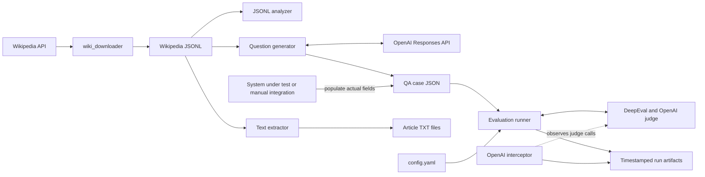

# Veris Evaluation System Requirements and Architecture

## 1. Purpose

This repository provides an offline workflow for building and evaluating retrieval-augmented generation (RAG) question-answering test cases. It supports:

- collecting and preparing Wikipedia source material;
- generating balanced answerable and unanswerable questions with an LLM;
- evaluating a system's supplied answers with decision and answer-quality metrics;
- recording judge-model interactions, token usage, and reproducible run artifacts.

The repository evaluates answers but does not currently execute the system under test. A caller or separate integration must populate `actual_answered` and `actual_output` before running the main evaluation.

## 2. Scope

### In scope

- Downloading random English Wikipedia articles.
- Inspecting JSONL source-data size characteristics.
- Extracting article text into individual UTF-8 files.
- Generating structured QA fixtures through the OpenAI Responses API.
- Resuming interrupted fixture generation.
- Classifying answer/refusal decisions as AA, NN, AN, or NA.
- Scoring contextual relevancy, answer relevancy, correctness, and faithfulness through DeepEval.
- Exporting detailed JSON, tabular CSV, token summaries, configuration snapshots, and raw OpenAI interaction logs.

### Out of scope in the current implementation

- Automatically uploading source documents to Veris or another RAG system.
- Calling the system under test for every generated question.
- Deriving `actual_answered` from answer text.
- Managing judge-model costs, rate limits, or concurrent evaluation.
- Providing a web interface or persistent database.

## 3. Users and External Systems

| Actor or system | Responsibility |
| --- | --- |
| Dataset maintainer | Downloads source data and generates QA fixtures. |
| System integrator | Sends each question and context to the system under test and populates actual results. |
| Evaluator | Selects configuration, runs evaluation, and reviews reports. |
| Wikipedia API | Supplies random article text and metadata. |
| OpenAI API | Generates structured questions and serves DeepEval judge requests. |
| DeepEval | Implements LLM-based quality metrics. |
| Veris API | Documented target RAG system; it is not called by the current Python evaluation pipeline. |

## 4. High-Level Architecture



## 5. Component Architecture

| Component | File | Current responsibility |
| --- | --- | --- |
| Wikipedia downloader | `wiki_downloader/wiki_downloader.py` | Requests random non-redirect English Wikipedia pages, filters short articles, deduplicates page IDs, appends JSONL records, and resumes from existing output. |
| Dataset analyzer | `analyze_jsonl_characters.py` | Reports line count and character-count statistics for a JSONL file. |
| Text extractor | `extract_wikipedia_texts.py` | Validates JSONL records and writes `{page_id}-{safe_title}.txt` files with Windows-safe names. |
| Question generator | `generate_wikipedia_test_cases.py` | Uses structured OpenAI output and Pydantic validation to generate alternating answerable/unanswerable cases, with retries and checkpoint recovery. |
| Evaluation runner | `evaluation.py` | Loads configuration and cases, constructs metrics, evaluates each question, computes decision statistics, and writes run artifacts. |
| API interceptor | `tools/openai_interceptor.py` | Temporarily patches synchronous and asynchronous OpenAI Chat Completions methods to log requests, responses, errors, and token usage. |
| Metric examples | `test_chatbot.py`, `test_veris.py` | Demonstrate DeepEval assertions against fixed sample answers; these are examples rather than coverage of the complete pipeline. |
| Runtime configuration | `config.yaml` | Selects case input, result location, judge model, thresholds, correctness criteria, output names, and interceptor settings. |

## 6. End-to-End Data Flow

1. The downloader appends Wikipedia records to a JSONL dataset.
2. The analyzer can inspect source-record sizes, while the extractor can produce one text file per article for upload or manual inspection.
3. The generator reads JSONL records, truncates each article to the configured CLI character limit, and asks OpenAI for an even number of alternating answerable and unanswerable questions.
4. The generator saves each accepted question immediately. Existing compatible output is treated as a checkpoint.
5. An external integration runs the target QA system and replaces the generated `null` values in `actual_answered` and `actual_output`.
6. The evaluator flattens documents into individual cases, runs four DeepEval metrics, determines the decision state, and writes a timestamped result directory.
7. The interceptor observes judge-model Chat Completions calls and supplies the data used for aggregate token reporting.

## 7. Functional Requirements

### FR-1: Source acquisition

- The downloader shall request namespace-0, non-redirect Wikipedia pages in batches.
- It shall store `page_id`, `title`, `text`, and `url` as one JSON object per line.
- It shall skip duplicate page IDs and articles shorter than 200 characters.
- It shall resume by reading IDs already present in its output file.
- It shall retry request and response-decoding failures after a delay.

### FR-2: Source inspection and extraction

- The analyzer shall accept an optional JSONL path and report count, mean, minimum, maximum, median, and mode of line character counts.
- The extractor shall reject malformed JSON and records missing `page_id`, `title`, or `text`.
- It shall create Windows-safe UTF-8 filenames and skip existing files unless `--overwrite` is supplied.

### FR-3: QA fixture generation

- The generator shall accept input/output paths, model, record limit/start, question count, context length, sampling seed, retry count, and overwrite mode through CLI options.
- `--questions-per-document` shall be an even integer of at least 2.
- Generated categories shall alternate between `answerable` and `unanswerable` so partial runs remain approximately balanced.
- Structured model output shall conform to the `GeneratedQuestion` Pydantic model.
- The generator shall reject category/boolean mismatches and exact duplicate names or questions within a document.
- Generated fixtures shall initialize `actual_answered` and `actual_output` to `null`.
- Each accepted question shall be written atomically through a temporary file before processing continues.
- Resume mode shall verify that saved page IDs remain a prefix of the currently selected input and that only the last saved document may be incomplete.
- An `OPENAI_API_KEY` environment variable shall be required.

### FR-4: Actual-answer integration contract

Before evaluation, an external process shall populate:

- `actual_answered` with a Boolean indicating whether the system gave a substantive answer;
- `actual_output` with the exact answer or refusal text returned by the system.

A refusal, a statement that no relevant information exists, or output that does not substantively address the requested information counts as `actual_answered: false`. Correctness is independent of this decision flag.

### FR-5: Evaluation

- The evaluator shall load its case file and run settings from `config.yaml`.
- It shall flatten every document's `questions` into independently scored cases while preserving document context.
- It shall evaluate these relationships:

| Metric | Compared values |
| --- | --- |
| Contextual Relevancy | question and retrieval context |
| Answer Relevancy | question and actual output |
| Correctness | actual output and expected output |
| Faithfulness | actual output and retrieval context |

- A metric shall pass when its score is greater than or equal to its configured threshold.
- A case shall pass only when its answer decision is correct and all four metrics pass.
- The configured judge model shall be used for all metrics.

### FR-6: Decision metrics

Each case shall receive exactly one state:

| State | `expected_answered` | `actual_answered` | Meaning |
| --- | ---: | ---: | --- |
| AA | true | true | Context supports an answer and the system answers. |
| NN | false | false | Context does not support an answer and the system abstains. |
| AN | true | false | False refusal. |
| NA | false | true | Unsupported answer. |

The evaluator shall calculate:

- Decision Accuracy: `(AA + NN) / Total`
- False Refusal Rate: `AN / (AA + AN)`
- Hallucinated Answer Rate: `NA / (NN + NA)`
- Answer Precision: `AA / (AA + NA)`
- Answer Recall: `AA / (AA + AN)`
- Abstention Precision: `NN / (NN + AN)`

A rate with a zero denominator shall be represented as `null` in JSON.

### FR-7: Run output and observability

- Each run shall create `evaluation_results/{timestamp}-{judge_model}/`.
- The run shall include:

| Artifact | Content |
| --- | --- |
| `results.json` | Decision summary and complete per-case results, reasons, inputs, outputs, and contexts. |
| `summary.csv` | One row per case/metric pair for spreadsheet analysis. |
| `token_summary.json` | Response count and aggregate prompt, completion, and total tokens. |
| `config_snapshot.yaml` | Exact configuration used by the run. |
| `openai_interactions.jsonl` | Intercepted judge requests, responses, errors, IDs, and usage when enabled. |

- The evaluator shall print each case result and a final run summary to standard output.
- The interceptor shall restore original OpenAI SDK methods when its context exits, including exceptional exits.
- Log writes shall be guarded by a lock for thread safety.

## 8. Data Contracts

### Wikipedia JSONL record

```json
{
  "page_id": 70533387,
  "title": "Ahmad Bazzi",
  "text": "Article text...",
  "url": "https://en.wikipedia.org/wiki/Ahmad_Bazzi"
}
```

Required by preparation scripts: `page_id`, `title`, and non-empty string `text`. The `url` is optional during generation.

### Evaluation case file

```json
[
  {
    "name": "wikipedia_70533387_ahmad_bazzi",
    "page_id": 70533387,
    "title": "Ahmad Bazzi",
    "url": "https://en.wikipedia.org/wiki/Ahmad_Bazzi",
    "retrieval_context": ["Article text..."],
    "questions": [
      {
        "name": "ahmad_bazzi_research_focus",
        "input": "What field does Ahmad Bazzi specialize in?",
        "expected_answered": true,
        "actual_answered": true,
        "actual_output": "Wireless communications.",
        "expected_output": "Wireless communications, especially Bluetooth."
      }
    ]
  }
]
```

The current evaluator assumes all listed fields are present and that actual values are non-null and valid when evaluation begins.

## 9. Configuration Requirements

`config.yaml` shall define:

- `project.cases_file`: QA fixture path relative to the project root.
- `project.results_directory`: root directory for run artifacts.
- `judge.model`: DeepEval/OpenAI judge model identifier.
- `metrics.*.threshold`: pass threshold for each metric.
- `metrics.correctness.criteria`: natural-language GEval rubric.
- `metrics.*.include_reason`: whether supported metrics return explanations.
- `output.*`: artifact filenames.
- `openai_interceptor.enabled`: whether Chat Completions logging is active.
- `openai_interceptor.log_file`: JSONL interaction-log filename.

Paths are resolved from the directory containing `config.yaml`, and the evaluator is expected to be launched with the repository root as its working directory.

## 10. Runtime and Dependency Requirements

- Python 3.10 or newer is required by the current type syntax; Python 3.12 is the documented environment.
- Python packages: `deepeval`, `openai`, `pyyaml`, `pydantic`, `requests`, and `pytest` for example tests.
- Network access is required for Wikipedia download, QA generation, and LLM-based evaluation.
- `OPENAI_API_KEY` must be supplied through the environment or a locally loaded `.env` file.
- Source and output text shall use UTF-8 encoding; CSV output shall use UTF-8 with BOM for spreadsheet compatibility.

Typical workflow:

```bash
python extract_wikipedia_texts.py
python generate_wikipedia_test_cases.py --limit 100
# Populate actual_answered and actual_output through the system integration.
python evaluation.py
```

## 11. Non-Functional Requirements

### Reliability

- Long-running generation shall retain every question reported as saved after interruption.
- Existing generated data shall not be overwritten unless explicitly requested.
- Evaluation output shall be isolated by run timestamp and judge model.

### Reproducibility

- Sampling shall be deterministic for a fixed input, `--start`, `--sample`, and `--seed`.
- The evaluation shall snapshot configuration alongside results.
- Saved retrieval context shall be reused during resumed generation even if the CLI context limit changes.

### Portability

- Extracted filenames shall avoid Windows-reserved characters and device names.
- All project paths shall use `pathlib` rather than platform-specific string concatenation.

### Security and privacy

- API keys and bearer tokens shall be supplied through environment variables and shall not be committed to source control or documentation.
- Interaction logs may contain full prompts, source contexts, and model responses and shall be handled as potentially sensitive artifacts.
- Production integrations should disable full request/response capture or protect the result directory when contexts contain private data.

### Maintainability

- Thresholds, model selection, paths, and filenames shall remain configuration-driven.
- Dataset preparation, target-system execution, evaluation, and observability shall remain separable responsibilities.

## 12. Known Constraints and Risks

- `evaluation.py` has no schema validation before indexing case fields; null or missing actual values can cause evaluation or API failures.
- The OpenAI interceptor observes Chat Completions `create` and `parse`, while fixture generation uses the Responses API and is therefore not included in evaluation token summaries.
- The downloader has module-level execution and fixed constants rather than a CLI.
- The main evaluator is sequential; large datasets can take substantial time and incur judge-model cost.
- The generator checks exact normalized duplicates but does not detect semantic paraphrase duplicates locally.
- Context is truncated by character count, which can cut text mid-section and omit relevant article material.
- Example pytest files use fixed judge models independently of `config.yaml` and do not test the complete data pipeline.
- External target-system execution remains a manual or separately implemented step.

## 13. Acceptance Criteria

The current workflow is operational when all of the following are true:

1. A valid Wikipedia JSONL source can be transformed into QA fixtures with an equal intended mix of answerable and unanswerable questions.
2. Interrupting and restarting generation continues from the last saved question without duplicating completed work.
3. A populated case file can be evaluated without modifying Python source.
4. Every case receives one decision state and four metric results.
5. A completed run produces the five configured artifacts in a unique result directory.
6. Aggregate decision counts match the number of evaluated questions.
7. Token totals are derived from logged judge responses when interception is enabled.
8. The configuration snapshot is sufficient to identify the case source, judge model, thresholds, and output settings used for the run.
